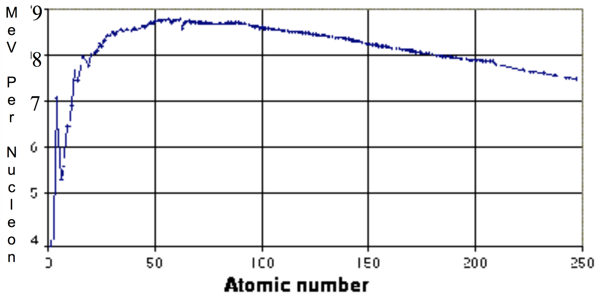

# f2007

## 1.
A neutral pion ($$\pi^0$$) has a rest mass of $$135\:\tfrac{\text{MeV}}{c^2}$$, and kinetic energy $$75\:\text{MeV}$$. All answers are numbers.

**(a)** Find its de Broglie wavelength (in $$\unicode{xC5}$$).

**(b)** Find its relativistic $$\gamma$$ (gamma).

**(c)** Find its velocity in terms of the speed of light.

**(d)** Find its total energy (in $$\text{MeV}$$).

**(e)** The $$\pi^0$$ decays into an electron and a positron ($$\pi^0\toe^+e^-$$). Find the velocity of the electron as viewed in the rest frame of the pion.

## 2.
Energies... All answers are numbers.

**(a)** One of the steps in the fusion process that takes place in the sun is the fusion of two $$^{3}\text{He}$$ nuclei to form $$^{4}\text{He}$$:
$$
^{3}\text{He}+^{3}\text{He}\:\to\:^{4}\text{He}+^{1}\text{H}+^{1}\text{H}
$$
Determine the amount of energy released in this process; state your answer in $$\text{MeV}$$.  Use the table provided on the last page of the test for this question; note that this table gives atomic masses, and also that the masses are given in $$\text{u}$$, where $$1\:\text{u}=931.5\:\tfrac{\text{MeV}}{c^2}.

**(b)** Use the table provided on the last page of the test to find the binding energy per nucleon in a $$^{4}\text{He}$$ nucleus; state your answer in $$\text{MeV}$$.

**(c)** Use the plot below of binding energy per nucleon versus atomic number to estimate the amount of energy released in the reaction
$$
n+^{235}\text{U}\:\to\:^{93}\text{Rb}+^{141}\text{Cs}+n+n
$$
State your answer in $$\text{MeV}

## 3.
An electron is trapped within the region $$-\tfrac{L}{2}<x<+\tfrac{L}{2}$$. The potential is equal to $$0$$ in this region and is infinite everywhere else.
**(a)** Write the time-independent Schrödinger equation as it applies to the region $$-\tfrac{L}{2}<x<+\tfrac{L}{2}$$.

**(b)** Write a solution to the equation in part a) in the form$$\phi(x)=A\sin{(ax)}+B\cos{(bx)}$$, where $$A$$ and $$B$$ are constants (to be determined in part c) and $$a$$ and $$b$$ are whatever you need to make this $$\phi(x)$$ the general solution to the Schrödinger equation.

**(c)** Find expressions for $$A$$ and $$B$$. You may way to use boundary conditions and the normalization requirement.

**(d)** Show that the energy states in for this trapped electron are given by $$E_n=\frac{n^2\pi^2\hbar^2}{2mL^2}$$

**(e)** Find the wavelength (in $$\unicode{xC5}$$) of the photon emitted when this electron makes a transition from the $$n=3$$ state to the $$n=2$$ state. Your answer should be a number.

**(f)** Find the probability that an electron in the $$n=2$$ energy state will be found between $$x=0$$ and
$$x=+\tfrac{L}{2}$$. (If you can guess what it is, tell me... but I want you to find it!)

## 4.
A new force is discovered which allows an electron to be bound to a “$$Y$$-on” to form a “$$Y$$ atom.” The attractive force between the $$Y$$ and the electron is $$F=-\frac{\alpha{a}_0^2\hbar{c}}{r^4}$$. ($$a_0$$ is the Bohr radius and $$\alpha$$ is the fine structure constant.)

a) Show that $$\hbar$$ has units of angular momentum, that is, $$\hbar$$ has the same units as mass times velocity times radius ($$mvr$$).

b) Given that angular momentum is quantized in units of $$\hbar$$ , that is, $$mvr=n\hbar$$, find an expression for the radii of electron orbits that shows these radii are quantized. Assume circular orbits.

c) Find the value (in $$\unicode{xC5}$$) of the radius of the smallest orbit, and explain why your answer either is or is not reasonable for the size of atomic orbit. The first part of your answer should be a number.

