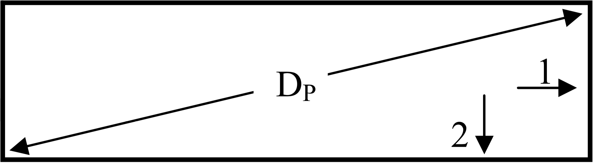
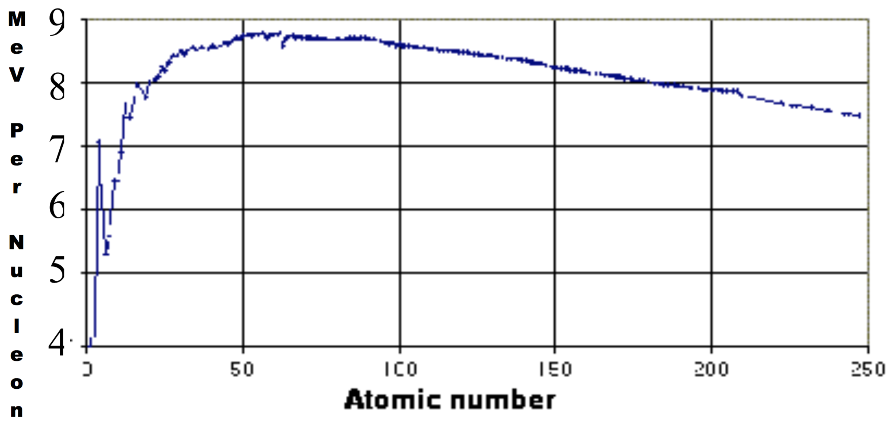

# f2008

## 1.
An interstellar cargo ship shaped like a box. When you are at rest with respect to it you measure its diagonal to be $$D_P$$, as shown. When the ship zooms past you at $$v=0.6c$$ in the direction marked “1” you measure the diagonal to be $$D_1=216\:\text{m}$$. When it zooms past you at $$v=0.6c$$ in the direction marked “2” you measure the diagonal to be $$D_2=253\:\text{m}$$. Find $$D_P$$, the proper length of the diagonal.

## 2.
Fusion and fission...

a) In the first step of the carbon cycle, a fusion process that occurs in very hot stars, a $$^{12}\text{C}$$ nucleus fuses with a proton to form $$^{13}\text{N}$$; a photon is released in the process: $$^{12}\text{C}+^{1}\text{H}\:\to\:^{13}\text{N}+\gamma$$.  Determine the energy (in $$\text{MeV}$$) of the photon.  The tables provided on the last page of the test may be useful for this question.

b) It is observed that $$^{250}_{98}\text{Cf}$$ can fission by splitting into two equal pieces
i) What element are the fragments?
ii) Use the plot (to the right) of binding energy per nucleon versus atomic number to estimate the amount of energy released (in $$\text{MeV}$$) in the splitting of $$^{250}_{98}\text{Cf}$$ into two equal pieces.

## 3.
Decays... The tables provided on the last page of the test may be useful for some parts this
question.

a) A parent atom ($$\text{P}$$) at rest undergoes a nuclear alpha decay to a daughter atom ($$\text{D}$$) plus a He nucleus ($$\alpha$$), that is $$P\to{D}+\alpha$$. Show that, in terms of the atomic masses, the kinetic energy of the \alpha is
$$
K_\alpha=\left(\frac{M_P}{M_D+M_\alpha}-1\right)M_D
$$

b) What are $$Z$$, $$ZD$$, $$D$$, and $$AD$$ when the alpha decay of $$^{215}\text{At}$$ is written in the form $$^{215}_{Z}\text{At}\:\to\:^{AD}_{ZD}\text{D}+\alpha$$
c) Use the equation in part a) to determine $$K_\alpha$$ for this decay.
d) Based on $$K_\alpha$$, would you expect the half-life of $$^{215}\text{At}$$ to be relatively long or relatively short? Explain.

## 4.
An electron is trapped within the region $$-\tfrac{L}{2}<x<+\tfrac{L}{2}$$. The potential is equal to $$0$$ in this region and is infinite everywhere else.

a) Write the time-independent Schrödinger equation as it applies to the region $$-\tfrac{L}{2}<x<+\tfrac{L}{2}$$ The general solution to this equation for this electron is of the form $$\phi(x)=A\sin{\left(\sqrt{\tfrac{2mE}{\hbar^2}}x\right)}+B\cos{\left(sqrt{\tfrac{2mE}{\hbar^2}}x\right)}$$, where $$m$$ is the mass of the electron.

b) Show that the energy states for this trapped electron are given by $$E_n=\frac{n^2\pi^2\hbar^2}{2mL^2}$$.

c) Consider constraints such as the boundary conditions and the normalization requirement to find expressions for $$A$$ and $$B$$ in the general solution.

d) The size of the box is on an atomic scale, $$L=2\:\unicode{xC5}$$. Find the wavelength (in $$\unicode{xC5}$$) of the photon emitted when this electron makes a transition from the $$n=3$$ state to the $$n=2$$ state. Your answer should be a number.

## 5.
A neutron has $$100\:\text{MeV}$$ of kinetic energy.
a) Find the relativistic gamma of this neutron.
b) Find the velocity (in terms of $$c$$) of this neutron.
c) Find the De Broglie wavelength (in $$\text{F}$$) of this neutron.
d) Would you be able to observe diffraction effects if this neutron were to encounter a typical nucleus? Explain.

