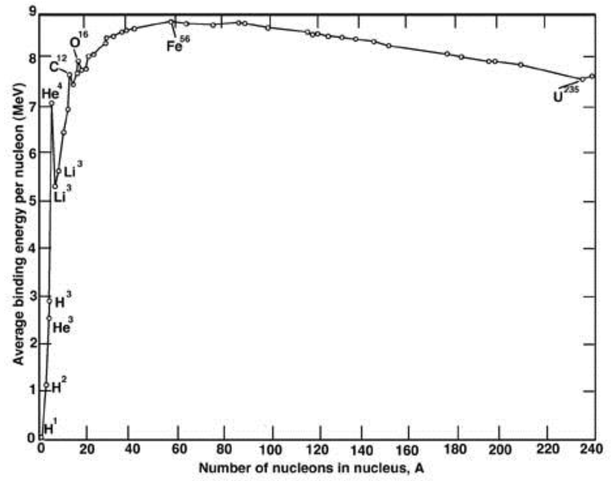

# f2009

## 1.
Bohr developed his atomic theory by requiring that the angular momentum of an electron in a circular orbit around a nucleus be quantized in units of $$\hbar$$.

**(a)** Show that the velocity of electrons in a Bohr hydrogen atom is quantized, specifically, find an expression for velocity that depends only on an integer quantum number $$n$$ and physical constants. (If your answer includes quantities other than $$n$$ that are variables, it’s not complete.)

**(b)** Express your answer to part a) in terms of $$c$$, the speed of light. (If you haven’t already...)

**(c)** Find the speed of an electron in the $$n=4$$ orbit of a hydrogen atom. Your answer can be a number or a number times $$c$$.

## 2.
Please put the letter of your answer for each part in the box.

**(a)** Identify the $$\beta^+$$ decay of $$^{40}_{19}{\text{K}}$$
1. .$$^{40}_{19}{\text{K}}\:\to\:^{40}_{18}\text{Ar}+e^++\nu_e$$
2. .$$^{40}_{19}{\text{K}}\:\to\:^{40}_{18}\text{Ar}+e^-+\bar{\nu}_e$$
3. .$$^{40}_{19}{\text{K}}\:\to\:^{36}_{17}\text{Cl}+e^-+\bar{\nu}_e$$
4. .$$^{40}_{19}{\text{K}}\:\to\:^{40}_{20}\text{Ca}+e^++\nu_e$$
5. .$$^{40}_{19}{\text{K}}\:\to\:^{39}_{18}\text{Ar}+e^++\nu_e$$

**(b)** Identify the $$\alpha$$-decay of $$^{238}_{92}\text{U}$$:
1. .$$^{238}\text{U}\:\to\:^{234}_{88}\text{Ra}+\alpha$$
2. .$$^{238}\text{U}\:\to\:^{234}_{92}\text{U}+\alpha$$
3. .$$^{238}\text{U}\:\to\:^{236}_{90}\text{Th}+\alpha$$
4. .$$^{238}\text{U}\:\to\:^{234}_{90}\text{U}+\alpha$$
5. .$$^{238}\text{U}\:\to\:^{234}_{90}\text{Th}+\alpha$$

**(c)** A nucleus consists of $$N$$ neutrons and $$Z$$ protons. Which is true?
1. .$$M_{\text{nucleus}}>N\:m_{\text{neutron}}+Z\:m_{\text{proton}}$$
2. .$$M_{\text{nucleus}}=N\:m_{\text{neutron}}+Z\:m_{\text{proton}}$$
3. .$$M_{\text{nucleus}}<N\:m_{\text{neutron}}+Z\:m_{\text{proton}}$$
4. .$$M_{\text{nucleus}}=N\:m_{\text{neutron}}+Z\:m_{\text{proton}}$$, but only if $$N>Z$$
5. .$$M_{\text{nucleus}}<N\:m_{\text{neutron}}+Z\:m_{\text{proton}}$$, but only if $$N>Z$$

**(d)** A hydrogen nucleus and Berilium can undergo fusion. Identify the reaction.
1. .$$^{1}_{1}\text{H}+^{2}_{1}\text{H}\:\to\:^{2}_{1}\text{H}+2\gamma$$
2. .$$^{1}_{1}\text{H}+^{2}_{1}\text{H}\:\to\:^{3}_{1}\text{H}+\gamma$$
3. .$$^{1}_{1}\text{H}+^{2}_{1}\text{H}\:\to\:^{3}_{2}\text{He}+\gamma$$
4. .$$^{1}_{1}\text{H}+^{2}_{1}\text{H}\:\to\:^{4}_{2}\text{He}+\gamma$$
5. .$$^{1}_{1}\text{H}+^{2}_{1}\text{H}\:\to\:^{3}_{1}\text{H}+p$$

**(e)** A terbuim nucleus has 65 protons. Which is true?
1. The most stable isotope of terbium has exactly 65 neutrons.
2. The most stable isotope of terbium has no more than 65 neutrons.
3. The most stable isotope of terbium has more than 65 neutrons.
4. The most stable isotope of terbium could have less than or more than 65 neutrons.
5. There can be no stable isotope of terbium.

## 3.
An electron of energy $$E$$ encounters a potential step of height $$V_0$$, where $$E$$ is less than $$V_0$$. In the picture, the electron is moving from left to right.

**(a)** Write out the time independent Schrödinger equation for the electron wave function $$\phi_1(x)$$ in the region $$x<0$$ and for the electron wave function $$\phi_2(x)$$ in the region $$x>0$$.

**(b)** Show, by direction substitution, that $$\phi_1(x)=Ae^{jk_1x}+Be^{-jk_1x}$$ is a solution to the time independent Schrödinger equation in the region $$x<0$$. $$\left(k_1=\sqrt{\tfrac{2m_eE}{\hbar^2}}\right)$$.

**(c)** Find $$\phi_2(x)$$, a general solution to the time independent Schrödinger equation in the region $$x>0$$. Express your answer in terms of $$k_2=\sqrt{\tfrac{2m_e(V_0-E)}{\hbar^2}}$$. You don’t have to show your answer is a
solution, but it wouldn’t hurt to check it!

**(d)** Find an expression for $$R$$, the probability that the electron is reflected back from the step. Give your answer in terms of $$k_1$$ and $$k_2$$.

**(e)** Evaluate $$R$$ from part d) when $$E=\tfrac{1}{2}V_0$$. Does this make sense? Explain.

## 4.
An electron is trapped in a potential well; the potential is $$V=0$$ between $$x=0$$ and $$x=L$$, and $$V\to\infty$$ for all other values of $$x$$.  The wave function for the electron is $$\Psi(x,\:t)=A\sin{\left(\tfrac{2mE}{\hbar^2} x\right)}e^{j\omega{t}}$$, where $$m$$, $$E$$, and $$\omega$$ are the mass, energy, and angular frequency of the electron respectively, and $$A$$ is a normalization constant.

**(a)** Find the normalization constant $$A$$.

**(b)** Show that the energy levels are quantized according to $$E_n=\tfrac{n^2\pi^2\hbar^2}{2mL^2}$$

**(c)** Treat the electron in a hydrogen atom as an electron trapped in this infinite well. Pick a reasonable value for $$L$$ and determine $$E_1$$. State your value of $$L$$. clearly.

## 5.
A deuterium nucleus (one neutron and one proton) can fuse with a tritium nucleus (two neutrons and one proton), forming a helium nucleus (two and two) and a neutron.

**(a)** Use the binding energy per nucleon curve to estimate the energy released in this process.

**(b)** Use other data provided on this test to check your answer to part a).

## 6.
An electron and a proton each have $$10\:\text{MeV}$$ of kinetic energy.

**(a)** Find the relativistic gamma of the electron and the proton.

**(b)** Is either the electron or the proton relativistic? Explain.

**(c)** Find the de Broglie wavelength of the proton.
