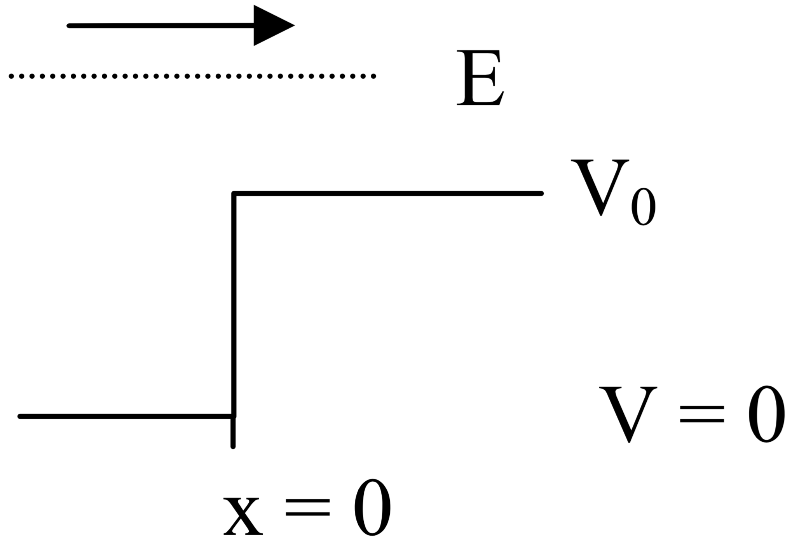

# f2010

## 1.
A neutral pion ($$\pi^0$$) of rest mass $$135\:\tfrac{\text{MeV}}{c^2}$$ has $$75\:\text{MeV}$$ of kinetic energy.

**(a)** What is its De Broglie wavelength in $$F$$ ($$1\:\text{F}=10^{-15}\:\text{m}$$)?

**(b)** What is its relativistic $$\gamma$$ (gamma)?

**(c)** The $$\pi^0$$ decays into a symmetric electron-positron pair.  In terms of the speed of light, what is the velocity of the electron and of the positron *as observed from the rest frame of the* $$\pi^0$$?

**(d)** The strong nuclear force has been modeled as protons and neutrons continuously emitting and either reabsorbing or exchanging “virtual” neutral pions. However, energy is not conserved in processes like $$p\to{p}+\pi^0$$. Explain briefly how nature allows this violation of energy conservation.

**(e)** Estimate the range of the strong force in $$\text{F}$$ by determining the distance that a virtual neutral pion (as in part d) can travel.

## 2.
Please put the letter of your answer for each part in the box.

**(a)** Identify the $$\beta^+$$ decay of $$^{40}_{19}{\text{K}}$$
1. .$$^{40}_{19}{\text{K}}\:\to\:^{40}_{18}\text{Ar}+e^++\nu_e$$
2. .$$^{40}_{19}{\text{K}}\:\to\:^{40}_{18}\text{Ar}+e^-+\bar{\nu}_e$$
3. .$$^{40}_{19}{\text{K}}\:\to\:^{36}_{17}\text{Cl}+e^-+\bar{\nu}_e$$
4. .$$^{40}_{19}{\text{K}}\:\to\:^{40}_{20}\text{Ca}+e^++\nu_e$$
5. .$$^{40}_{19}{\text{K}}\:\to\:^{39}_{18}\text{Ar}+e^++\nu_e$$

**(b)** The nucleus of a $$^{90}\text{Sr}$$ atom contains 38 protons and 52 neutrons.  Given $$m_p$$ is the mass of a proton and $$m_n$$ is the mass of a neutron, how does the mass of the $$^{90}\text{Sr}$$ nucleus compare with $$38m_p+52m_n$$?
1. $$38m_p+52m_n$$ equals the mass of the $$^{90}\text{Sr}$$ nucleus.
2. $$38m_p+52m_n$$ is greater than the mass of the $$^{90}\text{Sr}$$.
3. $$38m_p+52m_n$$ is less than the mass of the $$^{90}\text{Sr}$$.
4. There's no way to tell without knowing the details of the $$^{90}\text{Sr}$$.
5. $$38m_p+52m_n$$ equals the mass of the  $$^{90}\text{Sr}$$ unless a Compton scatter occurs.

**(c)** A nucleus consists of $$N$$ neutrons and $$Z$$ protons. Which is true?
1. .$$M_{\text{nucleus}}>N\:m_{\text{neutron}}+Z\:m_{\text{proton}}$$
2. .$$M_{\text{nucleus}}=N\:m_{\text{neutron}}+Z\:m_{\text{proton}}$$
3. .$$M_{\text{nucleus}}<N\:m_{\text{neutron}}+Z\:m_{\text{proton}}$$
4. .$$M_{\text{nucleus}}=N\:m_{\text{neutron}}+Z\:m_{\text{proton}}$$, but only if $$N>Z$$
5. .$$M_{\text{nucleus}}<N\:m_{\text{neutron}}+Z\:m_{\text{proton}}$$, but only if $$N>Z$$

**(d)** A hydrogen nucleus and Berilium can undergo fusion. Identify the reaction.
1. .$$^{1}_{1}\text{H}+^{7}_{4}\text{Be}\:\to\:^{7}_{4}\text{Be}+2\gamma$$
2. .$$^{1}_{1}\text{H}+^{7}_{4}\text{Be}\:\to\:^{8}_{4}\text{Be}+\gamma$$
3. .$$^{1}_{1}\text{H}+^{7}_{4}\text{Be}\:\to\:^{8}_{5}\text{B}+\gamma$$
4. .$$^{1}_{1}\text{H}+^{7}_{4}\text{Be}\:\to\:^{9}_{5}\text{B}+\gamma$$
5. .$$^{1}_{1}\text{H}+^{7}_{4}\text{Be}\:\to\:^{8}_{5}\text{B}+p$$

**(e)** A luteium nucleus has 71 protons. Which is true?
1. The most stable isotope of luteium has exactly 71 neutrons.
2. The most stable isotope of luteium has no more than 71 neutrons.
3. The most stable isotope of luteium has more than 71 neutrons.
4. The most stable isotope of luteium could have less than or more than 71 neutrons.
5. There can be no stable isotope of luteium.

## 3.
An electron of energy $$E$$ (traveling left to right in the figure) encounters an abrupt change in potential from $$V=0$$ to $$V=V_0$$ at $$x=0$$. $$V_0$$ is less than $$E$$, that is,$$V_0<E$$.

**(a)** Write a general wave function $$\phi(x)$$ that solves the Schrödinger equation in the region $$x<0$$ and also in the region $$x>0$$.  By “general” I mean that you should leave the amplitudes as variables.

**(b)** Find an expression, expressed in terms of $$k_1=\sqrt{\tfrac{2m_eE}{\hbar^2}}$$ and $$k_2=\sqrt{\tfrac{2m_e(E-V_0)}{\hbar^2}}$$ for the probability that the electron will get reflected back from the step.

**(c)** Show that your result for part b) gives sensible results for $$E=V_0$$ and also for $$E\to\infty$$.  I will give you the answer to part b) in exchange for points, if you ask.

## 4.
The time-independent wave function which describes a particle confined to the one-dimensional region $$-a<x<+a$$ is given by $$\phi(x)=A\sqrt{a^2-x^2}$$, where $$A$$ is a normalization constant.

**(a)** Find the normalization constant $$A$$.

**(b)** Find the probability of measuring the particle’s position to be in the range $$–\tfrac{a}{2}<x<+\tfrac{a}{2}$$. Your answer should be a number, for example, $$30\%$$. ($$30\%$$ is NOT the answer—it’s just an example of the form of the answer.)

## 5.
$$^{14}\text{C}$$ is a radioactive isotope of carbon. In naturally occurring $$\text{CO}_2$$, the ratio of $$^{14}\text{C}$$ to $$^{12}\text{C}$$ is $$1.3\times10^{-12}$$.  The half life of $$^{14}\text{C}$$ is 5730 years.

**(a)** How many protons and how many neutrons are in a $$^{14}\text{C}$$ nucleus?

**(b)** Find the binding energy per nucleon in a $$^{14}\text{C}$$ nucleus.

**(c)** If a 1000-kg chunk of carbon was formed when a tree died 7640 years ago, how many kg of $$^{14}\text{C}$$ can be expected to found in that carbon today?

**(d)** Determine the activity—decays per second—that the chunk of carbon in part c) would have had when it was formed.

