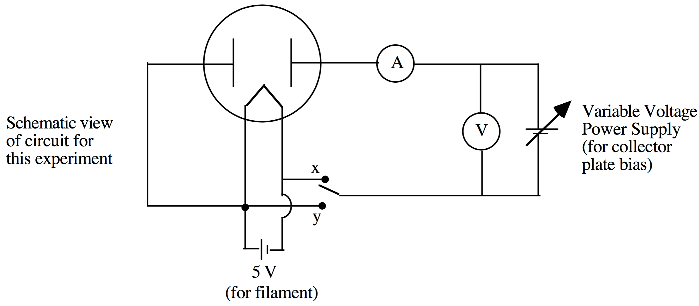

# lab02

##TITLE:
FIRST IONIZATION POTENTIAL OF MERCURY

##EQUIPMENTS:
- Radio tube, type 82 or 83 mercury rectifier
- Power supply ($$5\:\text{V}$$) for the filament of the tube
- Variable voltage source (DC) for the collector plate bias ($$0$$-$$15\:\text{V}$$)
- DC voltmeter for filament voltage ($$0$$-$$5\:\text{V}$$)
- DC voltmeter for collector plate bias ($$0$$-$$15\:\text{V}$$)
- DC milliammeter ($$0$$-$$25\:\text{mA}$$)

##INTRODUCTION AND BACKGROUND:
Child and Langmuir derived an equation relating the voltage between a pair of electrodes and the resulting electron current in high vacuum. In the model, a filament is maintained at constant temperature while a current flows through the filament. Electrons "evaporate" from the filament in a process called thermionic emission. A nearby collector plate is held at a positive potential to attract these electrons. Ignoring any space charge effects within the tube due to "screening" by electrons near the filament, the simple model predicts a linear relationship between the measured collector plate current and the collector plate bias voltage. In reality, however, the electron screening effects cannot be ignored. Taking these effects into account, Child and Langmuir showed that the plate current $$I$$ is related to the collector plate voltage $$V$$ by :
$$
I=kV^{\tfrac{3}{2}}
$$

where "$$k$$" is a constant. Thus, when $$I^{\tfrac{2}{3}}$$ is plotted vs. $$V$$, a straight line should result. In this experiment, you will use a rectifier tube partially filled with mercury ($$\text{Hg}$$) vapor to verify the result of Child and Langmuir at low collector plate potential. You will observe at higher voltages that your data deviate from the straight line of Child and Langmuir. This marked change in the shape of your graph, corresponding to a greater collector current for a given collector plate voltage, results from the ionization of Hg atoms, whose ejected electrons then contribute to the collector plate current. Thus, by measuring (and graphing) the collector plate current as a function of collector plate voltage, you can determine the ionization potential of mercury."

## LAB EXPERIMENT GOALS:
Determine the first ionization potential of mercury

## SUGGESTED EXPERIMENTAL PROCEDURE
Build a circuit which will allow you to measure the ionization potential of mercury ($$\text{Hg}$$). Use the schematic figure shown above as a guide. You may choose either circuit configuration "$$x$$" or "$$y$$". The required filament voltage is $$5.0\:\text{V}$$ dc. **Never exceed 5 volts on the filament!** Note that our $$\text{Hg}$$ tubes have two collector plates (these are the black rectangular objects you see in the tube). You will only use one collector plate to do these experiments. Connect the second plate to one side of the filament. Using the equipment provided, partially immerse the glass portion of the $$\text{Hg}$$ tube (upside-down) in a beaker of cool tap water, and monitor the temperature periodically throughout your experiments. The temperature should remain approximately constant.

Now begin the experiment to measure the ionization potential of mercury. Record the collector plate current as a function of the voltage applied to the collector (from your variable power supply). Use plate voltages from $$0\:\text{V}$$ to $$6\:\text{V}$$ in one-volt increments, and then continue with half-volt steps until the milliammeter goes off scale ($$\sim25\:\text{mA}$$). Try not to decrease the plate voltage at any time during a series of measurements, since the readings will not be reproducible. And remember to keep the filament voltage constant at $$5.0\:\text{V}$$!!

Note that a small current may exist in your tube even when the plate is slightly negative, due to the fact that some electrons leaving the filament may have thermal velocities that are sufficient to carry them to the plate against a small retarding potential.

## SUGGESTED ANALYSIS
1. Plot your data in the form of $$I^{\tfrac{2}{3}}$$ ($$y$$-axis) vs. $$V$$ ($$x$$-axis). Include appropriate error bars. You may notice that the points at low plate voltages do not lie exactly on a straight line. Can you understand this in terms of the relative size of the plate voltage and the filament voltage? The plot generated will reveal that the true electron accelerating voltage is not $$V_{\text{plate}}$$, but rather $$V_{\text{plate}}-V_0$$, where $$V_0$$ is a constant due to the IR drop along the filament, and is determined from the intercepts of the plotted lines on the voltage axis. The energy associated with the accelerating voltage at which ionization begins is the ionization potential. For $$\text{Hg}$$, the accepted value is 10.4 volts. Using your graphed data, determine the ionization potential of mercury. Your value for the ionization potential, taking into account your quoted experimental uncertainty, should agree with the accepted value of $$10.4\:\text{V}$$. Do the values agree? If not, why don't they? Briefly describe what is happening inside the tube when the $$I^{\tfrac{2}{3}}$$ plot vs. $$V$$ deviates from a straight line.

2. The electrons moving within the $$\text{Hg}$$ tube sometimes travel very short distances between collisions and other times they travel longer distances. The average path length between collisions is called the mean-free-path ($$\text{mfp}$$). From basic kinetic theory, the mean free path is given by:
$$
\text{mfp}=\frac{\text{R}T}{(\sqrt{2})\pi{P}\text{N}_0r^2}
$$
where $$\text{R}$$ is the universal gas constant ($$8.31\:\tfrac{\text{J}}{\text{mol-K}}$$), $$\text{N}_0$$ is Avagadro's number, $$T$$ is the absolute temperature ($$\text{K}$$) of the vapor, $$P$$ is the pressure ($$\text{Pa}$$) of the vapor at the temperature $$T$$, and $$r$$ (meters) is the radius of the mercury atom (take $$r\approx1.5\:\unicode{xC5}$$). The actual temperature of the mercury vapor in the radio tube is difficult to measure. For the purpose of generating a rough estimate, assume that the temperature is $$623\:\text{K}$$. The vapor pressure of mercury at this temperature is $$673\:\text{mm of Hg}$$. Convert this pressure to S.I. units and calculate the mean free path of the electrons in the mercury vapor. How many collisions does a typical electron experience on its way from the filament to the plate? Visually examine the construction of your rectifier and estimate the distance between the filament and the plate. Then compare your calculated value of the mean free path with the filament plate distance. Briefly discuss your result.

