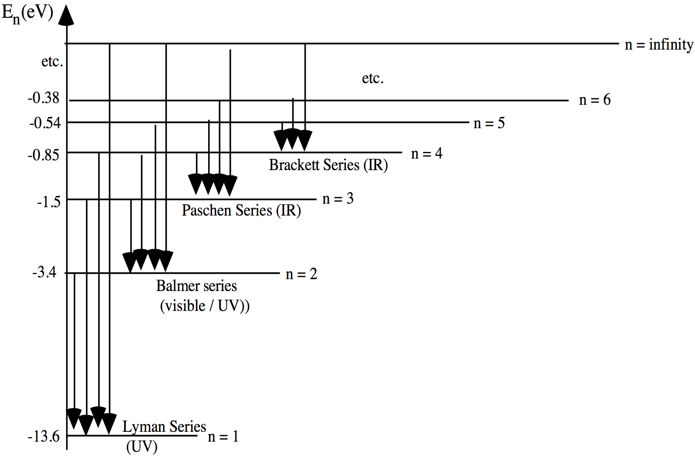

# LAB03:

##TITLE:
DETERMINATION OF THE BALMER SERIES WITH A SPECTROSCOPE

##EQUIPMENTS:
- Prism spectroscope;
- gas discharge tubes (Hg, He, H, ...);
- power supplies;
- scale illuminator

##INTRODUCTION AND BACKGROUND:
Spectroscopy dates back to ~1860, when Bunsen and Khircoff first studied spectra of assorted incandescent vapors. About 25 years later, Balmer studied more carefully the visible spectrum of hydrogen, and in the early 1900’s Bohr showed that the light emitted by an excited hydrogen atom could be
modeled using a quantum approach and three specific postulates, basically:
1. The electron in a H atom is bound in a circular orbit around the nucleus with the electron’s angular momentum quantized in units of $$\frac{h}{2\pi}=1.054\times10^{-34}\:\text{J}\cdot\text{s}$$ ($$h$$ is now called Planck’s constant);
2. The orbiting electron, although it is accelerating, radiates
energy *only* when it makes a transition between distinct electron orbits; and
3. If such a transition does occur, the radiation is emitted or absorbed in whole quanta of energy. (*i.e.*, the emitted light does not appear as a continuum in energy).  Combining these ideas allowed Bohr to predict the frequency, $$\nu$$, of the photon emitted (or absorbed) by an atom of atomic number $$Z$$ when an electron within the atom moves between energy levels $$E_i$$ and $$E_f$$. Assuming $$M_{\text{nucleus}}\gg{m}_e$$, Bohr’s result can be written simply as:
$$
\left|E_f-E_i\right|=h\nu=\left(\frac{2m_e\pi^2k^2Z^2e^4}{h^2}\right)\left|\frac{1}{n_f^2}-\frac{1}{n_i^2}\right|
$$
where $$n_i$$ and $$n_f$$ are integers that specify the initial-state and final-state electron energy levels in the atom, $$h=6.626\times10^{-34}\:\text{J}\cdots\text{s}$$, $$e=1.602\times10^{-19}\:\text{C}$$, $$m_e=9.11\times10^{-31}\:\text{kg}$$, and $$k=(4\pi\epsilon_0)^{-1}$$. For the case of H ($$Z=1$$), *i.e*, the system Bohr used to formulate his model, **Eq. 1** can be re-written to quantitatively predict the electron transition wavelengths, $$\lambda$$:
$$
\frac{1}{\lambda}=R_H\cdot\left|\frac{1}{n_f^2}-\frac{1}{n_i^2}\right|
$$
where $$R_H=1.09678\times10^{7}\:\text{m}^{-1}$$ is the Rydberg constant. (You will determine an experimental value for $$R_H$$ today). **Eq. 2** can be used to correctly predict the hydrogen spectrum (over 40 spectral lines) with great accuracy. The Lyman Series ($$n_f=1$$) lies in the ultraviolet (UV).  The Balmer series ($$n_f=2$$) lies in the visible. (These are the lines we will study today; do you understand why?) The remaining series ($$nf=3,\:4,\:5,\:\cdots$$) lie in the infrared (IR). The allowed energy levels of the electron in H (using the Bohr model) are shown schematically in **Figure 1.** Again, it is only when an electron moves between energy orbitals that a photon (quantum of electromagnetic energy) is emitted (or absorbed) by the atom.

## LAB EXPERIMENT GOALS
Calibrate a prism spectroscope using visible photons of known energies (wavelengths) emitted by excited He and Hg atoms (in two different gas tube sources) as their electrons jump between atomic orbitals. Then measure the visible spectrum of H and experimentally determine the Rydberg constant (accepted value $$R_H=1.09678\times10^{7}\:\text{m}^{-1}$$.) Have fun looking at the pretty colors today!

## SPECTROSCOPE SET-UP AND CALIBRATION
Use the Hg source to make the following necessary adjustments of the spectroscope before you begin taking data. Adjust the arms of the illuminated scale and/or the eyepiece of the telescope until the scale is in focus. Adjust the arm of the collimator until the spectral lines are superimposed on the illuminated scale image and there is minimal parallax. The slit opening should be narrow enough to provide sharp colored lines, yet wide enough to provide sufficient line intensity. The readings from the spectroscope scale (arbitrary units) will depend on the precise variation of the index of refraction of the prism you are using. Use the known wavelengths of the closely-spaced yellow Hg lines to estimate the resolution of your spectroscope.

The first data you need acquire today is calibration data for your particular spectroscope. You will use both Hg and He sources for this purpose. Observe the mercury (Hg) spectrum through your spectroscope. Record both the color (“yellow”, “green”, “blue”, *etc.*) and precise spectroscope-scale value (± uncertainty!) associated with **each and every colored line** you see in the Hg spectrum. Then repeat the same exercise two more times, using the He and H tubes provided. Be careful to note in your lab book (while you work) which gas tube corresponds to which data (set of colored lines). Do not knock the prism between data sets or your spectroscope
calibration will change and you’ll have to start over!

> ######**Figure.01** Schematic diagram of electron transitions in the H-atom.  Transitions that end on the $$n=1$$ level are in the Lyman Series (mostly UV). Transitions that end on $$n=2$$ belong to the Balmer Series (mostly visible).  Transitions that end on n=3 make up the Paschen Series (mostly IR)

##ANALYSIS:
Use the color information you recorded to compare your data for Hg and He (only) to the known electron energy-level transitions provided below.  Then **carefully and precisely** plot the known energy transition wavelength, $$\lambda$$, vs. scale number (your data) for every spectral line you observed with the Hg and He sources.  Plot your Hg and He data on the same graph.  Include error bars.  Combined, your plotted Hg and He data represents the calibration curve for your spectroscope.  Do this graph extremely carefully.  The quality of your final results today will depend critically on the quality of your Hg+He calibration graph!
####Some known visible spectral lines of Hg
|$$\lambda\:\left[\text{nm}\right]$$|   color  |
| --------------------------------- | -------- |
| 404.656 							|  violet  |
| 435.835 							|  blue-violet |
| 546.074							|  green   |
| 576.959							|  yellow  |
| 579.065  							|  yellow  |

####Some known visible spectral lines of He
|$$\lambda\:\left[\text{nm}\right]$$|   color  |
| --------------------------------- | -------- |
| 438.8 							|  violet  |
| 447.1 							|  blue-violet |
| 471.3								|  blue   |
| 492.1								|  blue-green  |
| 501.5  							|  green  |
| 504.7								|  green  |
| 587.5 							|  yellow  |
| 667.8 							|  red  |
| 706.5 							|  red  |

> ######Warning: Be careful when you match your data (colors) to known transitions. You may not have seen all of the lines listed in the tables above.

Next, use your calibration graph (Hg and He data) to experimentally determine the electron transition energies (as wavelengths) corresponding to your measured H spectrum.  Compare your results for the H lines (± your experimental uncertainties) to the accepted values given below.  Comment on any discrepancies.

####Some known visible spectral lines of H
|$$\lambda\:\left[\text{nm}\right]$$|   color  	| $$\Delta{n}$$ (Transition) |
| --------------------------------- | ---------	| -------------------------- |
| 438.8 							|  red  	|  3 to 2  |
| 447.1 							|  blue 	|  4 to 2  |
| 471.3								|  blue    	|  5 to 2  |
| 492.1								|  violet  	|  6 to 2  |

Now use the table above with hydrogen transition information to determine the values of $$n$$ to use for each of the colored lines you observed with the H source.  Make a new graph that shows your hydrogen electron-transition data in such a way that you can determine the Rydberg constant, $$R_H$$, from the graph.  Compare your experimental value of $$R_H$$ (± experimental uncertainty) to the accepted value of $$1.0968\times10^{7}\:\text{m}^{-1}$$.  Comment on any discrepancy.

*Finally*, use **Eqs. 1&2** (and $$1\:\text{eV}=1.602\times10^{-19}\:\text{J}$$) to experimentally determine the ionization energy of H, using your experimental value for $$R_H$$ (**hint**: $$n_i=?$$ and $$n_f=?$$).  Compare your result to the standard result, $$E=13.6\:\text{eV}$$.  Comment on any discrepancy.
