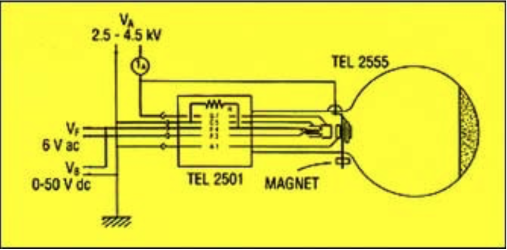
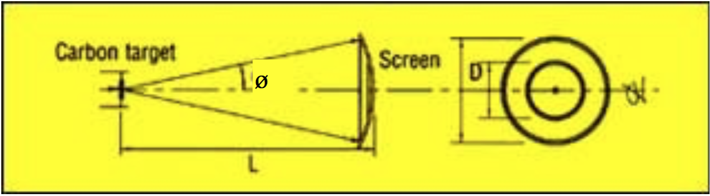
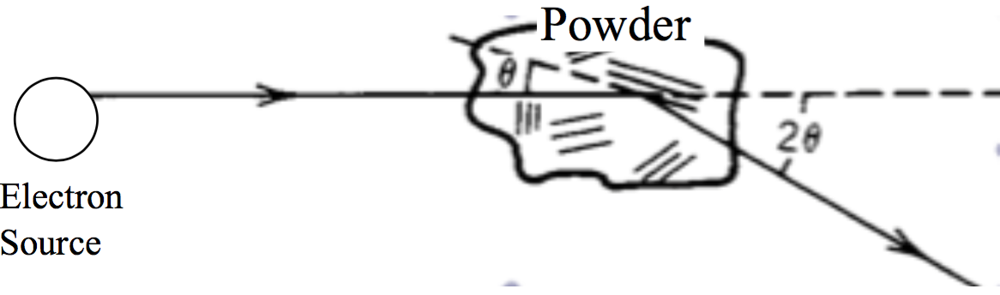

# LAB04:

##TITLE:
ELECTRON DIFFRACTION EXPERIMENT

## EQUIPMENTS:

## INTRODUCTION AND BACKGROUND:
In 1922 de Broglie combined Planck's quantum energy idea with the theory of relativity and proposed that since waves can act as particles, perhaps particles can also act as waves!  More specifically, de Broglie hypothesized that a particle's wavelength $$\lambda$$ can written in terms of its momentum $$p$$ and a constant $$h$$ (later named Planck’s constant; $$h=6.626\times10^{-34}\:\text{J}\cdot\text{s}$$) as:
$$
\lambda=\frac{h}{p}
$$

Three years later Davisson and Germer and also J. J. Thomson's son provided experimental confirmation that electrons do indeed act as waves!  Today you will use an electron diffraction tube to verify the de Broglie hypothesis and establish the dual (wave-particle) nature of the electron.  You will then use your data to determine the distance between layers of carbon atoms in a thin graphite target and compare your experimental results to the expected values ($$1.23\:\unicode{xC5}$$ and $$2.13\:\unicode{xC5}$$) for graphite.

The electron diffraction tubes (manufactured by TelAtomic) we have in lab produce a narrow beam of electrons from an indirectly heated, oxide-coated cathode.  The inside (coated) surface at the end of the diffraction tube serves as a (white) luminescent screen.  A micro-mesh nickel grid, onto which graphite has been deposited, lies across the exit aperture of the electron “gun” (see **figure 1**).  As the electron beam penetrates the graphite, the electron beam gets diffracted onto the luminescent screen, forming rings (**Figure 2.**) You will measure the diameters of the observed rings for different tube operating conditions, and use the results to determine the inter-atomic spacing of the carbon atoms in the graphite target.

######**Figure 1.** Electron diffraction tube (schematic view).

######Figure 2. Diffraction rings produced by electron “waves” scattered by carbon target.

##1.
Apply the heater voltage (~ few $$V$$) to the tungsten filament inside the tube (the electron source) and wait a minute or so for the temperature to stabilize.

##2.
Apply an anode voltage of $$4\:\text{kV}$$. (This is your electron accelerating voltage.)

##3.
Measure the diameter $$D$$ of the diffraction rings now visible on the luminescent screen.  The rings correspond to Bragg reflections from atomic layers in the graphite target. Make careful sketches in your lab notebook, noting the dimensions of each ring, the width of the perimeter of each ring, etc.  Be quantitative!

##4.
Repeat the experiment for several different anode voltages up to $$V=5\:\text{kV}$$.

##5.
Combining any relevant equations (hints below), show that the diameter $$D$$ of the rings is proportional to $$V^{-tfrac{1}{2}}$$, where $$V$$ is the accelerating potential applied to the electrons.

##6.
Plot your data with $$V^{-\tfrac{1}{2}}$$ on the y-axis and the ring diameter $$D$$ on the x-axis.  Be sure to include error bars on your graph!

##7.
From the slope of your graph, determine the inter-atomic spacing of carbon atoms in your polycrystalline target and compare your results to the expected value(s).

##8.
Discuss your results and conclude!

#### HELPFUL INFORMATION

- Bragg's condition:
$$
2d\sin{(\phi)}=n*\lambda
$$
- Electron energy:
$$
\text{eV}=\frac{p^2}{2m}
$$
- Electron wavelength:
$$
\lambda=\frac{h}{\sqrt{2m_eV}}
$$

