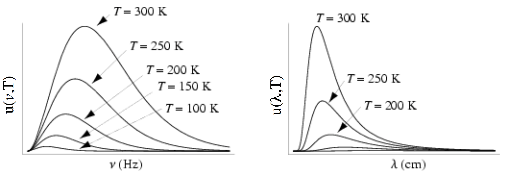
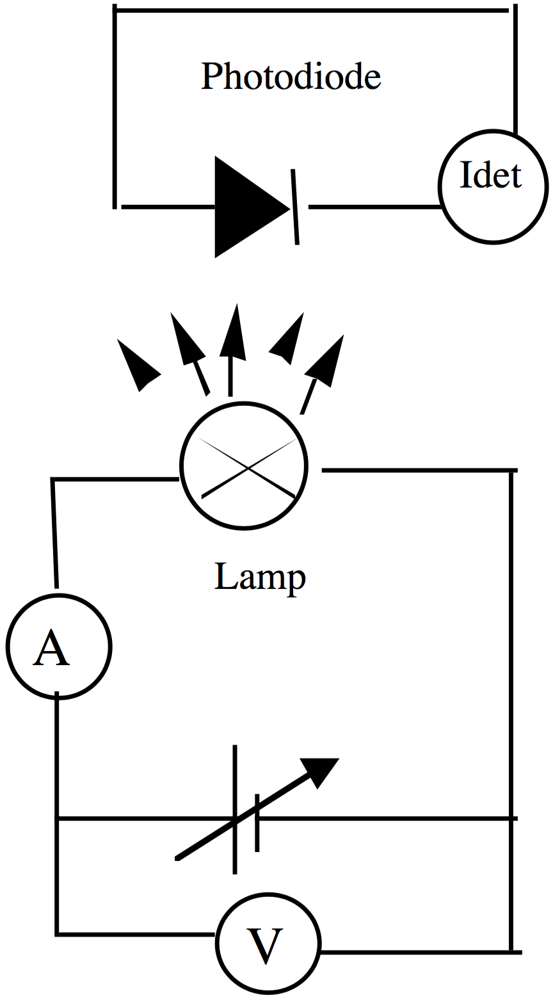

# LAB05:

##TITLE:
MEASUREMENT OF BLACKBODY RADIATION - Short Version

## Equipment:
- Calibrated quartz-halogen lamp with tungsten filament
- Fabry-Perot filters
- photodiode detector
- variable DC voltage source
- micro-ammeter
- black cloth.

## INTRODUCTION AND BACKGROUND:
Today you will directly measure the electromagnetic radiation emitted by a hot object at known temperatures. You’ll use Planck’s Law and its related equations to experimentally determine the value of $$\frac{hc}{k_B}/, where
- $$k_B$$:  Boltzmann's constant;
- $$h$$:  Planck’s constant
- $$c$$:  the speed of light in vacuum.
As derived in most modern physics and thermodynamics textbooks, the Stefan-Boltzmann Law:

$$
P_{BB}=\epsilon\sigma{A}(T^4-T_0^4)
$$
gives the total power $$P_{BB}\:\left[\tfrac{\text{J}}{\text{s}}\right]$$ radiated by a blackbody with surface area $$A$$, temperature $$T$$, and emissivity $$\epsilon$$ (an ideal blackbody has $$\epsilon=1$$) in a finite-temperature environment ($$T_0$$). The Stefan-Boltzmann constant, $$\sigma$$, is:
$$
\sigma=\left(\frac{2\pi^5k^5}{15h^3c^2}\right)=5.67\times10^{-8}\:\tfrac{\text{W}}{\text{m}^2}\tfrac{1}{\text{K}^4}
$$
where, again,
- $$k=k_B=1.38\times10^{-23}\:\tfrac{\text{J}}{\text{K}}$$;
- $$h=6.626\times10^{-34}\:\text{J}\cdot\text{s}$$;
- $$c=3.0\times10^{8}\:\tfrac{\text{m}}{\text{s}}$$.

**Fig. 1** shows the frequency (wavelength) dependence of the spectral energy density emitted by an ideal, isolated blackbody at different blackbody temperatures. The integral of any one curve in **Fig. 1** would yield the value of $$P_{BB}$$ defined above.  As shown in **Fig. 1**, each blackbody spectrum peaks at a distinct frequency (wavelength).  By differentiating the curves in **Fig. 1** one can determine the wavelength, $$\lambda_{\text{max}}$$, corresponding to the maximum energy density contained in a blackbody at a particular temperature $$T$$. The result is summarized by **Wein’s Law**:
$$
\lambda_{\text{max}}T=2.90\:\text{mm}\cdot\text{K}
$$
You can find derivations of Wein’s Law and all the other important equations used in today’s lab (Planck’s Law,
Stefan Boltzmann’s Equation, etc.) in most modern physics and thermodynamics textbooks.

######**Figure 1.** Spectral energy density of electromagnetic energy emitted by a blackbody at different temperatures, expressed in terms of either radiation frequency $$$$ or wavelength $$\lambda$$.

## LAB EXPERIMENT GOALS:
Today you will investigate the temperature dependence of the total radiative power emitted by a heated tungsten filament sitting inside a little black can. You’ll treat this system as a blackbody and test if the power radiated by the heated filament is, indeed, proportional to $$T^4$$.  Next, you’ll use a set of precision color filters to measure the energy radiated by the hot filament at specific wavelengths and for a series of known temperatures. From this data and using the equations above you will experimentally determine the value of $$\tfrac{hc}{k_B}$$.

##PART 1: BULB CALIBRATION:
Construct the circuit shown on the next page. For this portion of the lab, ignore the photodiode. For at least 6 known lamp bias voltages ($$V\leq10\:\text{V}$$) measure the current $$I$$ through your bulb.  From the measurements compute the electrical power $$P$$ delivered to the bulb and the resistance $$R$$ of the bulb.  Next, use the bulb’s calibration equation (below) to determine the temperature $$T$$ of the bulb for each bias voltage used:
$$
R=(-10.98\:\Omega)+(1.50\times10^{-2}\:\tfrac{\Omega}{\text{K}})\cdot{T}
$$
or
$$
$$

##PART 2: INVESTIGATING THE PLANCK LAW OF RADIATION:
The setup for this part of the experiment is similar to that used for Part 1. But now you will also use the photodiode. Ramp the bulb voltage $$V$$ from $$5.0\:\text{V}$$ to $$10.0\:\text{V}$$ in $$1.0\:\text{V}$$ steps, corresponding to six different filament temperatures (use your $$R$$ and $$T$$ information from Part 1).  For each bulb temperature measure the signal current Idet generated by your photodiode using at least three of the precision Fabry-Perot filters provided.  Each filter allows a small, select range of wavelengths (frequencies) emitted by your blackbody (source) to reach the photodioide (electromagnetic radiation detector). When you have all your data you are ready to move on to the analysis portion of this lab exercise.

##ANALYSIS FOR PART 1 (TEST THE $$~T^4$$ POWER LAW):
By conservation of energy, the electrical power used to make your lightbulb glow should appear as power radiated ($$\tfrac{\text{E}}{\text{s}}$$) by you’re the bulb.  If your system acts as a good cavity radiator then the Stefan-Boltzmann law should be satisfied.  A good way to test this is to graphically determine if the exponent “4” in the Stefan-Boltzmann equation is valid for your data.  Test this hypothesis by plotting $$\log{(P)}$$ (y-axis) vs. $$\log{(T)}$$ (x-axis) where $$P$$ is the power provide to your bulb (to make it glow) and $$T$$ is the temperature of the hot filament (get the value from the calibration equation).  Plotting the equation this way should give you a straight line (show mathematically in your lab book that this is true!).  From your plot, determine the exponent “$$n$$” in the expression for the radiated power $$P=\epsilon\sigma{A}T^n$$ and confirm that you were justified to ignore the environment temperature To in your analysis.  (Note that you also assumed conservation of energy: $$P_{\text{in}}=P_{\text{radiated}}$$!)

##ANALYSIS FOR PART 2 (DETERMINE $$\frac{hc}{k_B} USING THE PLANCK LAW OF RADIATION):
The Planck Law gives the energy density spectrum emitted by a blackbody at temperature $$T$$. Under the conditions studied today, and assuming a not-quite-ideal blackbody ($$ε\neq1$$, etc.), the Planck Law can be written approximately as:
$$
u(\lambda,T)d\lambda=\frac{8\pi{h}c\cdot\epsilon(\lambda,T)}{\lambda^5}\cdot\exp{\left(-\frac{hc}{\lambda{k}T}\right)}d\lambda
$$

where $$\epsilon(\lambda,T)$$ describes the actual emissivity of you bulb.  In the experiment today you monitored $$u(\lambda,T)d\lambda$$ by measuring the photodiode current generated by incoming radiation from your “blackbody” bulb after it had passed through specific Fabry-Perot (wavelength) filters.  Knowing the photodiode detector signal current, $$I_{\text{det}}$$, is directly proportional to the emitted blackbody spectrum, you can relate the measured quantity, $$I_{\text{det}}$$, to Plank Law’s using:

$$
I_{\text{det}}\propto\frac{r(\lambda)\cdot\epsilon(\lambda,T)}{\lambda^5}\cdot\exp{\left(-\frac{hc}{\lambda{k}T}\right)}
$$

where the parameter $$r(\lambda)$$ relates to the overall efficiency of the system (a function of wavelength), and takes into account factors such as
- aperture size,
- the transmitivity of the Fabry-Perot pass-band filters,
- the responsivity of the photodiode,
- the transmission of the bulb envelope,
- the effective area of the source, etc.

Taking the natural log of this last equation yields (to within a constant that depends on the detector calibration):
$$
\ln{\left(I_{\text{det}}\right)}=\text{constant}+\ln{\left[\frac{r(\lambda)\cdot\epsilon(\lambda,T)}{\lambda^5}\right]}-\frac{hc}{\lambda{k}T}
$$

So for a fixed $$\lambda$$, a plot of $$\ln{(I_\text{det})}$$ (y-axis) vs. $$\frac{1}{T}$$ (x-axis) should yield a straight line with slope = $$-\frac{hc}{\lambda{k_B}}$$!
Use this information to plot you!r photodiode detector data for each wavelength studied (you can do all graphs on the same page) and determine an experimental value for $$\frac{hc}{k_B}$$. Compare your result to the standard value of $$\frac{hc}{k_B}=1.439\times10^{-2}\:\text{K}\cdot\text{m}$$. Summarize and discuss your results.

