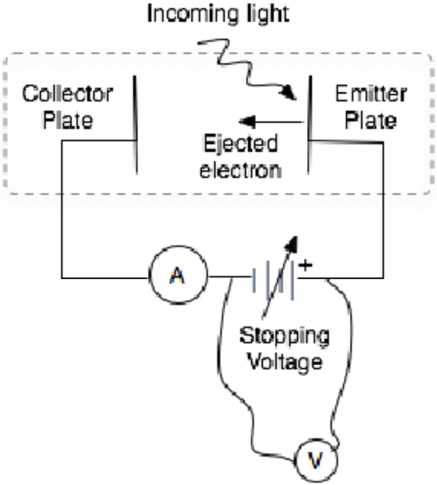

# lab06

## TITLE:
The Photoelectric Effect.

## EQUIPMENTS:
- Photoelectric Effect with amplifier unit (Model EP-05, Daedalon1 Corporation)
- Mercury light source (Model ML-900, Electro Technic Products, Inc.)
- Digital voltmeter (mV) and cables
- Light diffuser disk and color filters; “white light” lamp (optional); black cloth

## PURPOSE:
- Investigate the particle-like nature of light
- Measure $$\tfrac{h}{e}$$ (the ratio of two fundamental constants)
- Measure the photoelectric ‘work function’ of a given metal plate.

## PRELAB:
In preparing for this lab please review the discussion of the Photoelectric Effect in your physics text. You should come to lab with an understanding of the physics and relevant parameters of the experiment. You should of course also read through this entire handout *before* coming to lab.

*Optional* : For an enjoyable look at the development of atomic physics circa 1900, I highly recommend the book entitled: The Discoveries, by Alan Lightman, Pantheon Books, 2005 (ISBN 0-375-42168-8). This book includes portions of the original physics papers (translated into English!) referenced in this lab handout. The intriguing book by A. Lightman includes short chapters on several key discoveries in physics and biology during the 20th century.

## INTRODUCTION AND BACKGROUND:
The phenomenon of electron emission by monochromatic electromagnetic radiation impinging on a clean metal surface is called the photoelectric effect. The first person to perform careful studies of the emission of negative particles (electrons) from clean metal surfaces exposed to light was Philip Lenard. In 1902, Lenard showed2 that the emitted particles have a charge to mass ratio, e/m, equal to that measured by Thompson for what were then called cathode rays, now known to be electrons. Careful studies of the photoelectric effect quickly established that the kinetic energy of the emitted electrons does not depend on the *intensity* of the incoming light but only on the *frequency* “$$f$$” of the light. It was also found that the number of emitted electrons was proportional to the light intensity.

In 1905, Einstein proposed a radical concept of energy exchange to explain the photoelectric effect.  His model was formulated in terms of the quantum theory of electromagnetic radiation proposed earlier by Max Planck to explain blackbody radiation.  Einstein, working from the Planck assumption that light energy consists of discrete quanta of energy $$E=HF$$, postulated that these photons penetrate the surface of the metal and, when absorbed, transfer their entire energy to an electron in the metal. In Einstein’ s model, if the absorbed energy gives the electron sufficient energy to overcome the binding energy (the “work function”) of the host metal, the electron escapes from the surface with a kinetic energy equal to that of the original photon less the binding energy “$$e\phi$$” of the metal:
$$
\frac{1}{2}mv^2=hf-e\phi
$$

In this lab you will study the photoelectric effect and verify Eq. 1 that Einstein used to confirm the quantum theory of radiation. Using known frequencies of incoming light you will measure the minimum voltage needed to keep photoelectrons emitted from a metal plate (a photocathode) from striking a nearby collector plate. By graphing your results appropriately, you will determine both the work function of your photocathode and the value of $$\tfrac{h}{e}$$.

## PRINCIPLE OF OPERATION:
A schematic diagram of the experimental set-up is shown below. The collector and emitter plates are housed in a common vacuum phototube. The tube and its associated electronics (including an analog nano-ammeter and a variable voltage supply) are all enclosed in a small grey box. The box has a hole where photons from an external Hg lamp (or other light source) can enter and strike the phototube. The voltage of the variable supply will be measured using a digital voltmeter connected to the box via banana cables.

To study the photoelectric effect, the collector plate in the vacuum tube is made negative with respect to the emitter plate. Thus, the collecting surface will repel electrons coming from the emitter plate and only those electrons with enough energy to overcome this force will arrive at the collector plate and register a current in the ammeter. When the applied potential difference is large enough to repel the highest kinetic energy electrons ejected by light at a given frequency (*i.e.*, the electrons ejected from the topmost layer of the metal), the detected current will reach zero. The minimum voltage where this occurs is identified as the cutoff voltage, $$V_0$$, where:
$$
eV_0=\frac{1}{2}mv_{\text{max}}^2=hf-e\phi
$$

Here, $$e=1.6\times10^{-19}\:\text{C}$$ is the charge of the electron, Vo is the cutoff voltage, $$\frac{1}{2}mv^2$$ is the kinetic energy of the emitted electron, $$h=6.626\times10^{-34}\:\text{J}\cdot\text{sec}$$ is Planck’ s constant, $$f$$ is the highest frequency striking the emitter plate, and $$\phi$$ (or $$e\phi$$, depending on your definition) is the “work function” of the emitter plate. Notice that this equation yields a linear relationship between the stopping voltage ($$V_0$$) and the frequency of light, ($$f$$) striking the emitter plate:
$$
V_0=\left(\frac{h}{c}\right)f-\phi
$$

## SUGGESTED EXPERIMENTAL PROCEDURE:
1. To protect the sensitive photodetector unit, place a filter and/or a black cloth over the entrance port of the box that houses it. To protect your eyes (and the eyes of others), use a black cloth to cover the exit port of the blue box that houses your Hg light source. Then power-up both the photodetector unit and the Hg-light source and let them warm-up for ~10-15 minutes.

2. Connect a digital voltmeter (DVM) to the banana jacks on the top panel of your photodetector unit. You will use this meter to measure the stopping potential required to barely keep the photoelectrons ejected from the emitter plate from reaching the collector plate. (Note that the setting of the “VOLTAGE” knob on the photodetector box is what gets read out on your DVM.)

3. Now do the photoelectric effect experiment for four different wavelengths of incoming light using the Hg-tube with different color filters to pick-out the distinct colors of the Hg gas emission spectrum. WARNING! The filters we have are known to leak. To get meaningful results you will need to use the empirical filter data provided to interpret your raw data (before graphing).

	1. Install a filter in the path of your light source. Then point the filtered light at the input port of your photodetector box. Move things around gently until the analog ammeter of the photodetector collector plate registers a “large” but not saturated value.

	2. Without moving the instruments any more, carefully set the zero of your photodetector unit. (You will need to do this separately for each filter studied.) Turn the “VOLTAGE” knob fully clockwise (about $$3\:\text{V}$$). This will keep any photoelectrons emitted by the light shining on the photodetector emitter plate from reaching the collector plate. Adjust the “ZERO” knob on the photodetector box so the analog ammeter reads $$0\:\text{nA}$$. (No photoelectrons are able to make it to the plate, hence the measured current of $$0\:\text{nA}$$.)

	3. Turn the “VOLTAGE” on the collector plate back $$0\:\text{V}$$. The photodetector current should go back up to a moderately high value. This means that the light you are shining on the emitter plate in the photodetector unit is ejecting photo-electrons, which in turn make it all the way to the (now un-biased) collector plate.

	4. **This next step of the experiment is the most critical!** Carefully measure the detected photo-electron current ($$\text{nA}$$) as a function of the voltage you apply to the collector plate. Watch carefully for changes in photocurrent as you increase the retarding potential. Note carefully in your lab book each time you see the current suddenly drop more than expected (it might be subtle). Extend your measurements all the way to zero detectable current. Note very carefully the voltage corresponding to the onset of zero current. This is the stopping potential for the highest-energy (smallest wavelength) light source coming through your source filter. [If multiple photon line sources are present, e.g, if a filter is “leaky”, you should see each color “cut-out” at distinct values of retarding potential. Explain in your lab book why this is true!]

	(e) Quickly repeat your measurement to be sure you did not miss anything interesting. Before continuing to the next filter, be sure each lab partner has taken at least one set of independent data for the group. Be sure you each record your own data, for each filter set-up measured. You may later combine data with your partners, but you will do so during the analysis later.

	(f) Repeat steps (a)--> (e) for a total of four filter / light source combinations, with separate data sets for each lab partner!

# SUGGESTED ANALYSIS:
1. Use your data and the given information about your filters and Hg light source, to best determine which wavelengths (or frequencies) of light made it through the filters in each of your photoelectric effect measurements.

2. Plot your data in the form “Stopping-Voltage” (Y-axis) vs. “Incident Photon Frequency” (X-axis). Explain clearly in your lab notebook the physics significance of this choice of axes! Include appropriate error bars on your graph.

3. Your data should be consistent with a straight-line fit. (Again, why is this?) If appropriate, determine the best-fit straight line to your data (including error bars). Then determine your experimental result for “$$\tfrac{h}{e}$$” and “$$\phi$$” (the emitter plate work function). Your final results must include $$\pm\:\text{uncertainties}$$. There are different ways to get the error estimates.  I suggest you use a simple graphical technique that involves also drawing “max-slope” and “min-slope” fits to your data (error bars).

4. Does your result for $$\tfrac{h}{e}$$ (± error) agree with the accepted value of $$4.136\times10^{-15}\:\frac{\text{J}\cdot\text{sec}}{\text{C}}$$?  Comment briefly on the difficulty of the measurements and describe the origin of your largest experimental uncertainties.  **NOTE**: “Human Error” is not an acceptable answer here! How do you think the experiment uncertainties could be improved? How could any systematic errors be reduced, or better understood?

**REMINDER**: You will be graded (in part) on the quality of your graphs so do them carefully!

| Light Source | Color | Wavelength | Frequency |
| :----------: | :---: | :--------: | :-------: |
| Hg | Ultraviolet | $$3650\:\unicode{xC5}$$ | $$8.21\times10^{14}\:\text{Hz}$$ |
| Hg | Violet | $$4047\:\unicode{xC5}$$ | $$7.41\times10^{14}\:\text{Hz}$$ |
| Hg | Blue | $$4358\:\unicode{xC5}$$ | $$6.87\times10^{14}\:\text{Hz}$$ |
| Hg | Blue-green | $$4916,\:\:4960\:\unicode{xC5}$$ | $$6.10\times10^{14}\:\text{Hz}$$ |
| Hg | Green | $$5461\:\unicode{xC5}$$ | $$5.49\times10^{14}\:\text{Hz}$$ |
| Hg | Yellow | $$5770,\:\:5791\:\unicode{xC5}$$ | $$5.49\times10^{14}\:\text{Hz}$$ |
| Light Bulb | Rainbow | various  | various|
| He-Ne laser | Red | $$6328\:\unicode{xC5}$$ | $$4.74\times10^{14}\:\text{Hz}$$ |
| Green laser | Gren | $$5320\:\unicode{xC5}$$ | $$5.64\times10^{14}\:\text{Hz}$$ |

