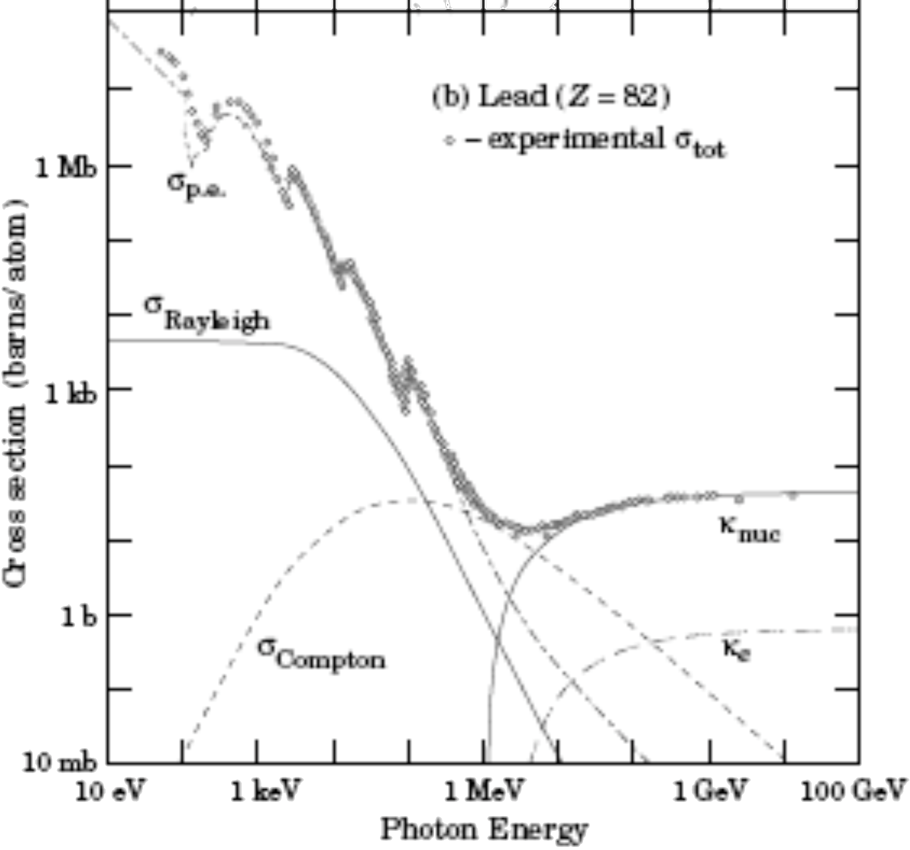
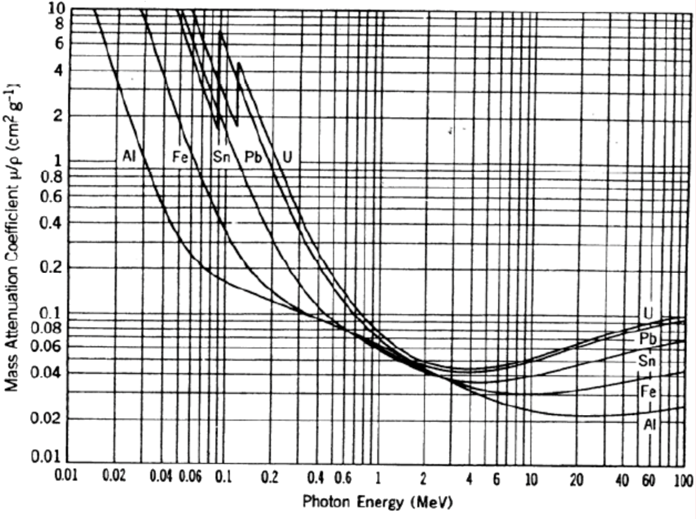
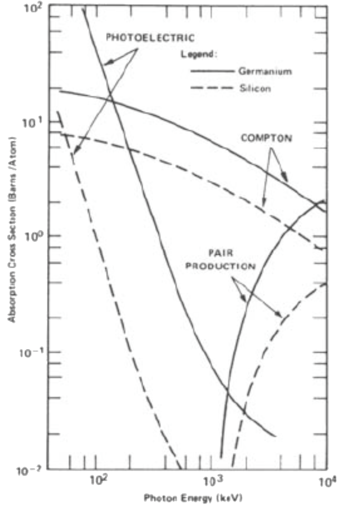
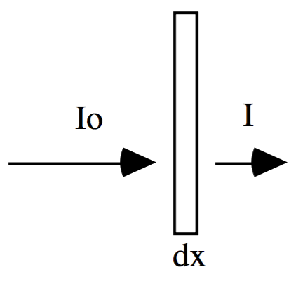

# lab07

##TITLE:
The Geiger Muller Tube & Absorption of Gamma Rays

## EQUIPMENTS:
- Geiger Muller tube and sample holder
- Scaler / timer
- Lead absorbers
- Radioactive gamma ray source, e.g., $$^{137}\text{Cs}$$, which emits gamma ($$662\:\text{keV}$$) and betas ($$512,\:1173\:\text{keV}$$ endpoint energies)

##PURPOSE:
- Learn to calibrate and operate a Geiger—Muller tube radiation detector
- Learn about random nature of nuclear decay process and $$\sqrt{N}$$ uncertainties
- Measure a gamma ray count rate as a function of Pb absorber thickness
- Determine the mass attenuation coefficient for $$0.662\:\text{MeV}$$ photons in Pb

##INTRODUCTION AND BACKGROUND
There are three basic mechanisms by which a gamma ray ($$\gamma$$) entering a material may lose energy.  All three mechanisms result from a primary interaction of the photon with electrons in the target material.  The mechanisms are:

| name | process |
| :--: | :------ |
| Photoelectric absorption: | $$\gamma+\text{atom}\to\text{ion}+\text{ejected electron}$$ |
| Compton scattering: | $$\gamma+\text{atom}\to\gamma+\text{ion}+\text{ejected electron}$$ |
| Pair production: | $$\gamma+\text{atom}\to\text{ion}+e^{-}+e^{+}$$ |

Essentially all of the gamma ray energy is transferred to the ejected electron in photoelectric absorption. In Compton scattering, only some fraction of the incident gamma ray energy is transferred to the electron. An electron-positron ($$e^-\:e^+$$) pair is produced in pair production.  As shown in the figure below, the photoelectric absorption process dominates at low energies. At intermediate energies, Compton scattering becomes important.  The specific crossover energy at which Compton scattering becomes more important than photoelectric absorption in a given material depends on the target material atomic number "$$Z$$".  Pair production is the dominant energy-loss mechanism for high energy gamma rays.  Note that pair production does not occur if the gamma ray energy is less than $$1.02\:\text{MeV}$$. (Why?)

In the experiments that follow, you will use a Geiger-Muller (G-M) radiation detector. The G-M tube is a metallic cylinder with a metal wire along its axis. The tube has a thin "window" at one end (or along one side, depending on the detector design) to let in particles. The coaxial inner wire is held at high electric potential with respect to the metallic case of the G-M tube. (For this experiment, you will likely apply to the wire a bias voltage of order $$600\sim900\:\text{V}$$.) The G-M tube is filled with a suitable gas, such as argon. When a gamma ray (or a neutron, or a charged particle like an electron or alpha particle) passes through the G-M tube, it can ionize the gas within the G-M tube. The electrons and ions so produced accelerate towards the wire and shell, respectively. This slight ionization of the gas produced by the initial interaction will produce secondary ionization in that each electron will produce ionizations as they accelerate to the electrodes (wire and G-M tube shell).  Hence, a current pulse will occur in the detection circuit producing a voltage pulse across a resistance.  The resulting voltage pulse gets amplified and registered in the scaler; thus the individual particles entering the G-M tube are counted.  The entire process, from the entrance of a single particle until it is counted requires only $$\approx200\:\mu\text{s}$$.  A second particle which enters the tube within this time frame of $$200\:\mu\text{s}$$ (the tube "dead time") will not be counted. Keep this in mind when running your experiments today, and always keep your count rate below $$\approx50\:\tfrac{\text{counts}}{\text{s}}$$ so that you will not have to correct for "dead time" of your detector.  Beta particles (electrons) penetrate the thin G-M tube window easily and are then detected.  Alpha particles lose their energy much more rapidly when passing through matter (including air!), thus they have difficulty penetrating a G-M tube window. Being electrically neutral, gamma rays penetrate the window rather easily. However, because gamma rays may travel relatively large distances without interacting with matter, the efficiency of a G-M tube for detecting gamma rays is only a few percent.

> **Figure.01** Interaction cross section of photons in lead. ($$1\:\text{barn}=10^{-28}\:\text{m}^2$$).

> **Figure.02** Mass attenuation coefficients for various elements.

> **Figure.03** Attenuation of photons in silicon and germanium. (Not used in this lab exercise. Included for comparison only.)

In the schematic diagram below, an incident gamma ray beam of intensity Io impinges upon a target material of thickness $$dx$$.  A fraction of the incident gamma rays are stopped by the target (the "absorber") and the remaining pass through unaffected.  The intensity of the gamma ray beam fully penetrating the target material we shall call "$$I$$".

Thus, the fraction of the beam absorbed (*i.e.*, lost to the material) is:
> eq(01)
$$
\frac{dI}{I}=-\mu{dx}
$$

where $$\mu$$ is the total absorption coefficient of the material and $$dI=I-I_o<0$$. Integrating equation (1) gives:
>eq(02)
$$
I(x)=I_0e^{-\mu{x}}
$$

where $$I(x)$$ is the beam intensity after passing through material of thickness "$$x$$". The total absorption coefficient is energy dependent, and is a sum of three terms:
> eq(03)
$$
\mu=\mu_{\text{photo}}+\mu_{\text{Compton}}+\mu_{\text{pair}}
$$

In general, high density materials have a high density of electrons; hence they are better absorbers of gamma rays than are low density materials.  In order to compare the absorbing properties of various materials, we define the "mass absorption coefficient" ($$\mu_m$$) and the target "mass thickness" ($$x_m$$):
> eq(04)
$$
\begin{matrix}\mu_m=\tfrac{\mu}{\rho}&x_m=x\cdot{\rho}\end{matrix}
$$

where "$$\rho$$" is the material mass density (e.g., $$\tfrac{\text{g}}{\text{cm}^3}$$) and "$$x$$" is the actual material thickness (e.g., $$\text{cm}$$).  For a Pb absorber, the mass thickness $$x_m$$ ($$\tfrac{\text{g}}{\text{cm}^3}$$) = $$(\text{target thickness})\cdot(11.34\:\tfrac{\text{g}}{\text{cm}^3})$$.

## SUGGESTED EXPERIMENTAL PROCEDURE

#### 1.
Establish the operating voltage of your Geiger-Muller tube, using a Cs-137 (or other suitable) radiation source. To do this, place the source near the active window of your detector. Without moving the source, make a series of measurements of the detected count rate as a function of operating voltage. If you see the count rate rapidly increase with increasing bias, **stop taking data** and turn the voltage back down towards zero.  You have forced the detector into its "avalanche" mode, which is not desirable here!  Please see the lab instructor for guidance.  Plot the measured count rates vs. G-M detector bias voltage. Include error bars, as appropriate. You should observe a region of operating voltages for which the detector count rate is relatively insensitive to bias (operating) voltage.  This is called the "plateau" region.  Using your calibration curve as a guide, adjust your detector bias to lie in this "plateau" region.  You will use this bias for the remainder of the lab exercises today.  Make a note of it in your lab book.  Put your radiation source back in the authorized storage area of the lab, and pay careful attention your lab neighbors' source situation before continuing to the next step in this laboratory exercise (background measurement).

#### 2.
Measure the background count rate at the operating voltage you have chosen.  Express the count rate in counts per minute ± uncertainty.  If you don't know how to estimate the experimental uncertainty here, ASK!! Do not continue until you understand error analysis for this experiment.

#### 3.
Using a Cs-137 source (gammas and betas) and the absorbers provided, measure the attenuation length of gamma rays in lead. Record the count rate observed in the G-M detector as a function of thickness of lead absorbers placed between the detector window and the source. For each absorber thickness, count for at least 1 minute before going to the next thickness of Pb absorber. Make a series of similar measurements for a total of $$\approx8$$ different absorber thicknesses. For all measurements in the series, the source should remain at a fixed location relative to the G-M tube. Subtract the background rate (counts per minute) from each data point. Propagate error estimates appropriately.

## ANALYSIS
The measured count rate as a function of absorber thickness "$$x$$" may be written:
$$
I(x)=I_0e^{-\mu{x}}
$$
or, in terms of mass thickness ($$x_m$$) and mass absorption coefficient ($$\mu_m$$):
$$
I(x_m)=I_0e^{-\mu_{m}x_m}
$$

#### 1.
Plot your background-adjusted data on a linear-linear scale ($$I\:\text{vs.}x_m$$). Include error bars on your graph. Does the curve look exponential?

#### 2.
Next, plot your background-adjusted data in a way such that a straight line is expected. (**HINT**: Think about logarithms!) Again, include error bars on your graph. Does this graph suggest that the thinnest lead absorber stops the beta rays? Explain.

#### 3.
From one of your graphs, determine the mass absorption coefficient of Pb for $$660\:\text{keV}$$ gamma-rays.

#### 4.
Use the plot of photon mass absorption coefficients vs. energy given below to compare your experimental value of the mass absorption coefficient for $$660\:\text{keV}$$ photons in Pb to the commonly- accepted value.  Briefly discuss your results.
