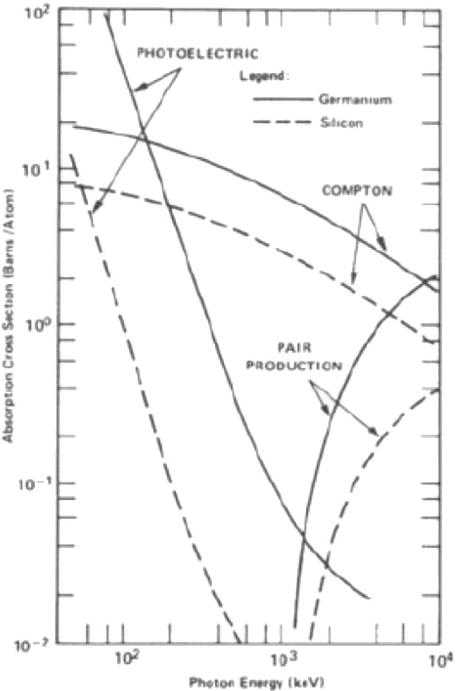
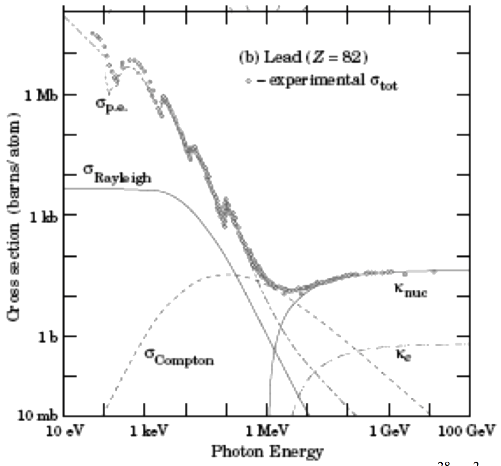
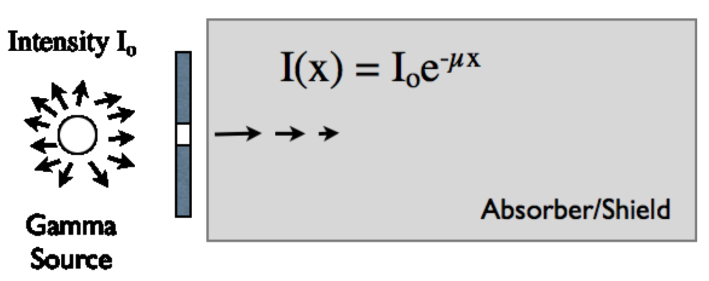
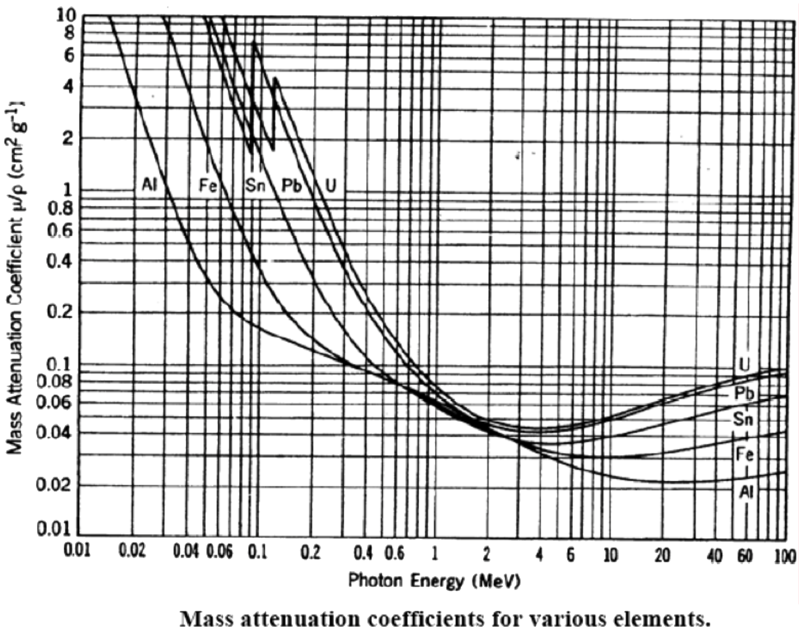

# lab08

##TITLE:
The Geiger Muller Tube & Absorption of Gamma Rays

## EQUIPMENT:
- Geiger Muller tube and sample holder; Scaler / timer; Lead absorbers
- $$^{137}\text{Cs}$$ source ($$662\:\text{keV}$$ gamma rays) and betas ($$512,\:1173\:\text{keV}$$ beta endpoint energies)

## LAB OBJECTIVE:
- Learn about Nuclear physics and undergo official lab training to safely use $$\gamma$$ and  $$\beta$$ sealed sources
- Calibrate and operate a Geiger—Muller tube radiation detector
- Learn about random nature of nuclear decay process and $$\sqrt{I}$$ uncertainties
- Measure a gamma ray count rate as a function of $$\text{Pb}$$ absorber thickness
- Determine the mass attenuation coefficient for $$0.662\:\text{MeV}$$ photons in $$\text{Pb}$$

## INTRODUCTION AND BACKGROUND:
The three basic mechanisms by which gamma rays (γ) lose energy in a material are:
1. Photoelectric absorption (essentially all of the incident $$\gamma$$ energy is transferred to an $$e^-$$):
$$
\gamma+\text{atom}\to\text{ion}+e^{-}
$$
2. Compton scattering (only a fraction of the incident $$
\gamma$$ energy is transferred to an $$e^{-}$$):
$$
\gamma+\text{atom}\to\gamma+\text{ion}+e^{-}
$$
3. Pair production (a sufficiently energetic $$\gamma$$ can transform to an electron-positron pair):
$$
\gamma+\text{atom}\to\text{atom}+e^{-}+e^{+}
$$

For a given absorber material (see Figs. 1-2 for $$\text{Si}$$, $$\text{Ge}$$ and $$\text{Pb}$$) the photoelectric absorption process dominates at low energies, such as those used in our experiments today. At intermediate energies, Compton scattering becomes important. The specific crossover energy at which Compton scattering becomes more important than photoelectric absorption in a given material depends on the target material atomic number "Z". Pair production is the dominant energy-loss mechanism for high energy gamma rays. Recall that pair production does not occur if the gamma ray energy is less than $$1.02\:\text{MeV}$$. (Why?) In general, high density materials like lead ($$11.34\:\tfrac{\text{g}}{\text{cm}^3}$$) have a high density of electrons and are good absorbers of gamma rays.

> ###### **Figure.01** Attenuation of $$\gamma$$-rays in $$\text{Si}$$ and $$\text{Ge}$$

> ###### **Figure.02** Interaction scale for $$\gamma$$-rays in $$\text{Pb}$$ $$(1\:\text{barn}=10^{28}\:\text{m}^2)$$

> ###### **Figure.03** Our experiment $$\gamma$$-rays exponentially attenuated by $$\text{Pb}$$

**Only after you undergo class-specific radiation safety training and listen to an introductory lecture on nuclear physics, will you get to do your first nuclear physics experiment.** You will use a Geiger-Muller (G-M) radiation detector to study $$\gamma$$-rays (and possibly $$\beta$$’s depending on your radioactive source) of known energies. The G-M tube is essentially an evacuated metallic cylinder with a metal wire along its long-axis. The tube has a thin "window" at one end (or along one side, depending on the detector design) to let in particles (*e.g.*, $$\gamma$$’s or $$\beta$$‘s). The coaxial inner wire is held at high electric potential (typically $$600$$-$$900\:\text{V}$$) with respect to the metallic case of the G-M tube. The G-M tube is filled with a low pressure of argon. When a gamma ray (or other particle) passes through the G-M tube, it can ionize the gas inside the tube. The electrons and ions so produced accelerate towards the wire and shell, respectively. This ionization of the gas produced by the initial interaction produces secondary ionization as the prompt electrons and ions accelerate to the electrodes (wire and G-M tube shell). Hence, a current pulse will occur in the detection circuit producing a voltage pulse across a resistance. The resulting voltage pulse gets amplified and registered in a “scaler”. This is how individual particles entering ad interacting in the G-M tube are counted. The entire process, from the entrance of a single particle until it is counted requires only $$\approx200\:\mu\text{s}$$. A second particle which enters the tube within this time frame of 200 μsec (the tube "dead time") will not be counted. Keep this in mind when running your experiments today, and always keep your count rate “low enough” that you will do not have to correct for the "dead time" of your detector.

Some G-M tubes have a sufficiently thin entrance window such that $$\beta$$-particles (electrons) of modest energy can penetrate the window and be detected. We have two styles of G-M tubes at SCU; only one is reasonably sensitive to betas. (Have a look at each type and you should understand why this is.) As we’ll discuss in lab, alpha particles lose their energy much more rapidly when passing through matter (including air!), thus they have difficulty penetrating a G-M tube window. Being electrically neutral, gamma rays penetrate the window rather easily. However, gamma rays can travel relatively large distances inside the G-M tube (the gas inside is rather dilute) so the efficiency of a typical G-M tube for detecting gamma rays is only ~ a few percent.

## SUGGESTED EXPERIMENTAL PROCEDURE:
1. Establish the operating voltage of your Geiger-Muller tube, using a suitable radiation source. To do this, place the source near the active window of your detector. Without moving the source, make a series of measurements of the detected count rate as a function of G-M tube operating voltage. If you see the count rate rapidly increase with increasing bias, **stop taking data** and turn the voltage back down towards zero. You have forced the detector into its "avalanche" mode, which is not desirable here! (See the lab instructor for guidance.)

2. Graph your measured count rate $$I$$ vs. G-M detector bias voltage. Include error bars (e.g., $$\sqrt{I}$$), as appropriate. You should observe a region of operating voltages for which the detector count rate is relatively insensitive to bias (operating) voltage. This is called the "plateau" region. Using your calibration curve as a guide, adjust your detector bias to lie in this "plateau" region. Make a note of the value in your lab book. **You will use this bias for the remainder of the lab exercises today**. Put your radioactive calibration source back in the authorized storage area of the lab, and pay careful attention your lab neighbors' source situation (note it in your lab book!) before continuing to the next step.

3. Measure the background count rate at the operating G-M voltage you have chosen. Express the count rate in counts per minute ± uncertainty. If you don't know how to estimate the experimental uncertainty here, ASK!! Do not continue until you understand error analysis for this experiment.

4. Choose suitable source (*e.g.*, Cs-137) to measure the attenuation of $$\gamma$$-rays in lead. There are many sources available, so be sure to record the following source information in your lab book:
**(a)** What is the isotope?
**(b)** What is its half-life?
**(c)** What types of radiation does your source emit?
**(d)** What are the emitted energies?
**(e)** What is the “activity” of your source? ($$1\:\text{Ci}=3.7\times10^{10}\:\tfrac{\text{decays}}{\text{s}}$$)

5. Record the count rate observed in the G-M detector as a function of thickness of lead absorbers placed between the detector window and the source. Start with no $$\text{Pb}$$ absorber present. For each absorber thickness, count for at least 1 minute before going to the next $$\text{Pb}$$ absorber. Make a series of measurements for a total of ~ 6-8 different absorber thicknesses. For all measurements, **the source must remain at a fixed location relative to the G-M tube**. (Why?) Subtract the background rate (counts per minute) from each data point. Propagate error estimates appropriately. Below, you will use your data to determine the γ-ray attenuation coefficient of $$\text{Pb}$$ (or whatever absorber material you used) for $$\gamma$$-rays emitted by your source.

## SUGGESTED ANALYSIS:
1. The count rate $$I(x)$$ of gamma-rays detected by your G-M detector as a function of $$\text{Pb}$$ absorber thickness x between your source and the G-M detector is well modeled by:
$$
I(x)=I_0e^{-\mu{x}}
$$
where $$I_0$$ is the rate ($$\tfrac{\text{number}}{\text{s}}$$) at which $$\gamma$$-rays from your source enter a $$\text{Pb}$$ absorber sheet of thickness $$x$$ and $$I(x)$$ is the $$\tfrac{\text{number}}{\text{s}}$$ of $$\gamma$$-rays making it through the $$\text{Pb}$$ absorber without getting stopped. The factor “$$\mu$$” is the gamma-ray attenuation coefficient and its value depends on material (e.g., $$\text{Pb}$$) and $$\gamma$$-ray energy (depends on the radioactive isotope). Plot your background-adjusted data for G-M count rate for your different $$\text{Pb}$$ thicknesses in a way such that a straight line is expected. (**HINT**: Think about logarithms!) From the graph, determine the mass absorption coefficient of $$\text{Pb}$$ for the $$\gamma$$-rays emitted by your source. If your source emits both betas and gammas, does your graph suggest that the thinnest lead absorber stops the beta rays? Explain.

2. Compare your experimental value of the mass absorption coefficient for gammas in lead to the commonly accepted value (for your energy of gammas) using the graph provided below. You will need to be consistent with units—I’ll let you figure that out. Briefly discuss your results.

> ###### **Figure.04** Mass attenuation coefficients for various elements
