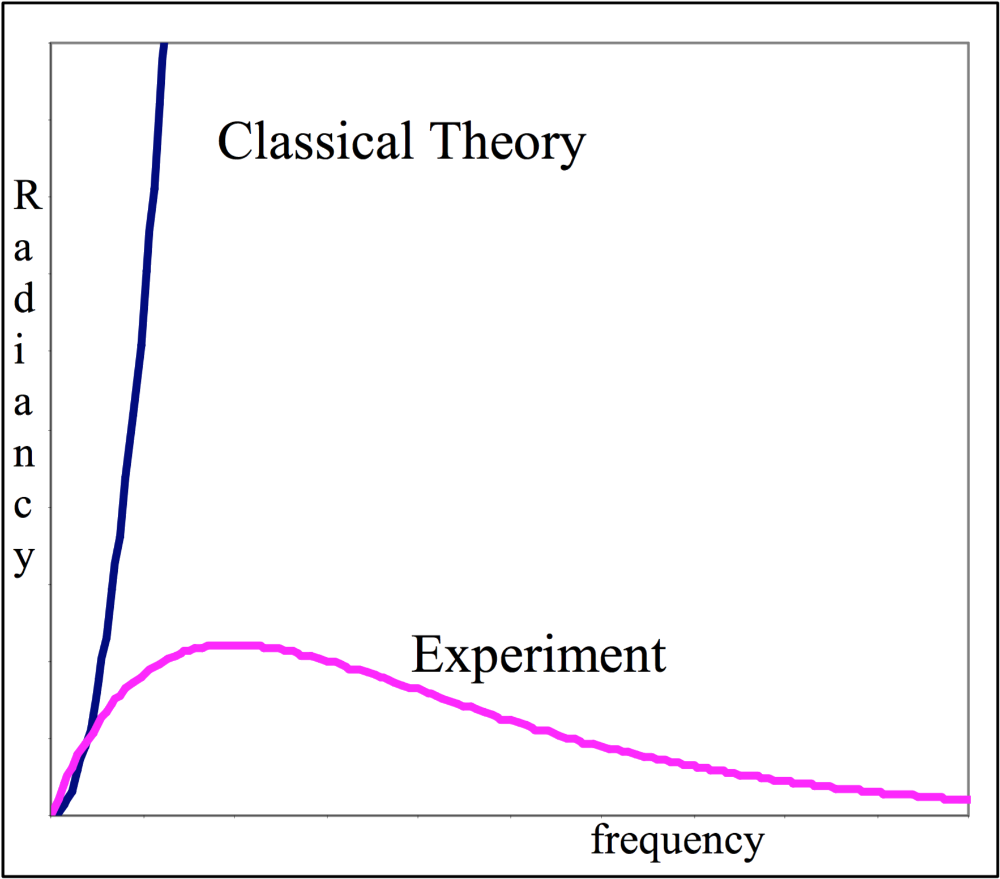

# mt2007a

##1.
A precision clock and a small laser are attached to a straight rod of length $$L=20\:\text{m}$$ on
earth then shot out into space at velocity $$v= 0.9c$$. It is observed by a scientist on the space station as it passes by and heads off to parts unknown.

**(a)** What does the observer measure as the length of the rod?

**(b)** The observer’s clock ticks off 10 seconds during the time she watches the rod. How
long a time interval does the clock attached to the rod show during her 10 seconds?

**(c)** As the rod is approaching the space station the laser is fired. Use the Lorentz velocity transformation to determine the velocity (in terms of c) that the observer measures for the speed of the laser light. (**Partial credit** if you can get a reasonable answer via intuition.)

