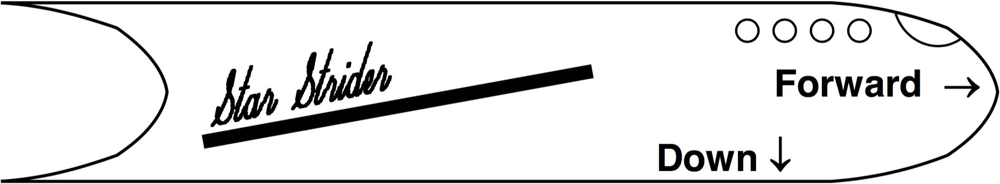

# mt2008

##1.
The Star Strider, Obi-Wan Kenobi’s private racing ship, is $$200\:\text{m}$$ long (its proper length) when measured in space dock. Obi-Wan has reminders about the directions it flies, and also a racing stripe, painted on the Star Strider, as shown. He also has a precision atomic clock on the bridge (which can be seen through the window) that has a proper tick length of 1 second.

**(a)** The Star Strider flies past you in the Forward direction at velocity (relative to you) $$v=0.9c$$.

- **(i)** How long (in $$\text{m}$$) does the Star Strider appear to you?
- **(ii)** How long (in $$\text{m}$$) does the Star Strider appear to Obi-Wan, who is flying it?
- **(iii)** How long (in $$\text{s}$$) does one clock tick last, as you measure it?
- **(iv)** How long (in s) does one clock tick last, as Obi-Wan measures it?

**(b)** Obi-Wan flies past (going Forward) with relativistic  $$\gamma=3.203$$; you measure the length of the racing stripe to be $$L_{\to}=36.95\:\text{m}$$. When he is landing (going Down) at the same speed, you measure the length of the racing strip to be $$L_{\downarrow}=98.03\:\text{m}$$. Find the proper length (in \text{m}) of the racing stripe, that is, the length you would measure when the Star Strider is at rest in space dock.

##2.
The neutral $$\phi$$ particle can decay into two charged pions, that is, $$\phi\to\pi^+\pi^-$$. The rest mass of the $$\phi$$ is $$m_{\phi}=1020\:\text{MeV}/c^2$$ and the rest mass of the charged pion is $$m_{\phi}=140\:\text{MeV}/c^2$$.

**(a)** A $$\phi$$ particle decays as rest; the pions are produced symmetrically.
 - **(i)** Find the total energy (in $$\text{MeV}$$) of one of the pions.
 - **(ii)** Find the kinetic energy (in $$\text{MeV}$$)  of one of the pions.
 - **(iii)** Find the velocity (to 3 digits, in terms of $$c$$) of one of the pions.

**(b)** The $$\phi$$ particle is moving through the lab at $$v=0.7c$$ when it decays. One pion is thrown directly forward (relative to the direction of the $$\phi$$. Find the velocity (to 3 digits, in terms of $$c$$) of this pion as measured in the lab frame.

##3.
A photon can scatter off an electron via Compton scattering...

**(a)** The Compton wavelength is given by $$\lambda_C=\frac{h}{m_e{c}}$$, where $$m_e$$ is the mass of an electron. Compute a value for $$\lambda_C$$ (in $$\unicode{xC5}$$). You can use numbers on the first page, or any others that you know.

**(b)** Is it possible to observe Compton scattering of visible light? Explain.

**(c)** A photon undergoes two successive Compton scatters, the first at $$30^{\circ}$$ and the second at $$60^{\circ}$$; the outgoing photon has wavelength $$\lambda_f=0.12\:\unicode{xC5}$$. Find the initial wavelength (in $$\unicode{xC5}$$) of the photon.

##4.
A certain metal has a work function of $$\phi_0=9.0\:\text{eV}$$.

**(a)** Find the threshold wavelength (in $$\unicode{xC5}$$) of light that will produce the photoelectric effect.

**(b)** A photon of wavelength $$\lambda=1000\:\unicode{xC5}$$ strikes the metal. Find the maximum kinetic energy (in $$\text{eV}$$) of an electron ejected from the metal after absorbing this photon.

##5.
The spherical surface of a certain light bulb, of radius $$0.10\:m$$, emits like a blackbody. Photons emitted from the bulb have energy $$E_{\gamma}=2.0\:\text{eV}$$. When you hold your hand $$2\:\text{m}$$ from the center of the bulb, the intensity of the emitted energy is $$3.78\:\text{W}/\text{m}^2$$.

**(a)** Find the total power (in $$\text{W}$$) of the bulb.

**(b)** Find the surface temperature (in $$\text{K}$$) of the bulb.

**(c)** Find the number of photons per second given off by the bulb.
