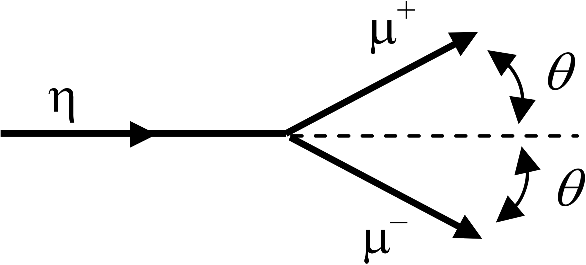

# mt2010

##1.
A long time ago, in a galaxy far, far away, little Luke Skywalker slides down the Colossal Slide at the Galactic Amusement park. The engineers who built the Colossal Slide measured it to straight and $$9\times10^6\:\text{m}$$ long. The drag on Luke as he slides results in a constant velocity of $$0.8c$$ as observed by his Aunt Beru watching from a nearby bench, which is at rest with respect to the Colossal Slide.

**(a)** How long (in $$\text{m}$$) does the Colossal Slide appear to Luke as he slides down?

**(b)** How long (in $$\text{m}$$) does the Colossal Slide appear to Aunt Beru?

**(c)** How long (in $$\text{s}$$) does it take for Luke to slide down, as observed by Luke?

**(d)** How long (in $$\text{s}$$) does it take for Luke to slide down, as observed by Aunt Beru?

**(e)** Aunt Beru can see Luke’s wristwatch, which has a hand that reads out in milliseconds, as he slides by. How long does (in $$\text{ms}$$) does it take for Luke’s watch to tick $$1\:\text{ms}$$, as observed by Aunt Beru?

**(f)** As he slides down, Luke fires his laser pointer (he’s too young for a light saber) straight forward. Use the Lorentz contraction to find the speed (in terms of $$c$$) of the laser beam as observed by Aunt Beru.

##2.
A neutral η particle can decay into a pair of charged muons: $$\eta\to\mu^+\mu^-$$. Take the rest mass of the $$\eta$$ as $$548\:\text{MeV}/c^2$$ and the rest mass of the muons as $$106\:\text{MeV}/c^2$$.

**(a)** Consider an $$\eta$$ carrying $$300\:\text{MeV}$$ of kinetic energy $$\eta$$ which decays as shown to the right. Find the angle $$\theta$$ at which the two muons leave the decay.

**(b)** Consider the decay of an $$\eta$$ in which the muons go off in exactly opposite directions with exactly the same kinetic energy when viewed in the rest frame of the $$\eta$$. (**NOTE**: The drawing above is NOT this case!) Find the kinetic energy of each muon as viewed in the rest frame of the $$\eta$$.

**(c)** For the decay described in part (b), find the velocity of each of muon as viewed in the rest frame of the $$\eta$$. Give your answer as a number times the speed of light.

##3.
A 35-W monochromatic light bulb emits photons uniformly in all directions. The bulb is placed a $$4\:\text{m}$$ from a gold target the presents a cross-sectional area $$2\:\text{cm}$$ by $$3\:\text{cm}$$ to the light. The energy of the light is just sufficient to liberate electrons from the gold via the photoelectric effect. The work function of gold is $$\phi_0=5.10\:\text{eV}$$.

**(a)** Is the light from this bulb visible to humans? Justify your answer.

**(b)** Find the number of photons per second radiated by the bulb.

**(c)** Find the photoelectric current arising in the target, assuming the gold surface is clean and there are many electrons as necessary right at the surface. Express your answer in electrons per second.

**(d)** If the energy of the radiated photons is increased, but all other aspects of this setup remain the same, will the photoelectric current increase, decrease, or stay the same? Justify your answer.

##4.
A photon of wavelength $$\lambda=0.002\:\text{nm}$$ Compton scatters off an electron at rest. The scattered electron is observed to leave the interaction with $$0.3\:\text{MeV}. **NOTE**: the picture is not intended to accurately represent the angles at which the photon and electron leave the interaction point.

**(a)** Find the energy (in $$\text{MeV}$$) of the scattered photon.

**(b)** Find the angle $$\theta$$ at which the scattered photon leaves the interaction.

