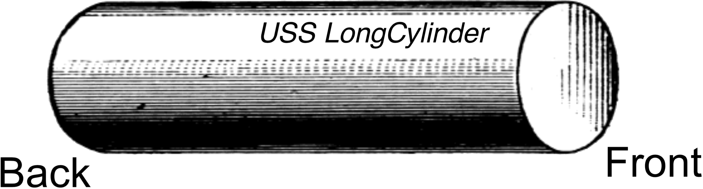

# mt2011a

##1.
When the USS LongCylinder was built in space dock its length, defined as the distance from the “front” to the “back,” was $$1000\:\text{m}$$. An accurate clock, with a hand that ticks off 1 second at a time, was installed on bridge. Bronson Steele, the captain of the USS LongCylinder, normally flies it so that the direction of motion is aligned with the length of the ship. The USS LongCylinder zooms past Earth at a speed of $$0.4c$$ as measured by an Earthbound observer. (Neglect any effects due to Earth’s rotation.)

**(a)** How long (in $$\text{m}$$) does the USS LongCylinder appear to Captain Steele?

**(b)** How long (in $$\text{m}$$) does the USS LongCylinder appear to the Earthbound observer?

**(c)** How long (in $$\text{s}$$) does it take for the clock on the bridge to tick off 10 seconds, as observed by Captain Steele?

**(d)** How long (in $$\text{s}$$) does it take for the clock on the bridge to tick off 10 seconds, as observed by the Earthbound observer (who looks through a telescope to see the clock)?

**(e)** As he zooms past Earth, Capt. Steele fires his forward laser so that a beam of light is emitted straight out from the front of the ship. How fast does the laser light travel, as observed by Capt. Steele? A good guess without other proof is acceptable.

**(f)** As he zooms past Earth, Capt. Steele fires his forward laser so that a beam of light is emitted straight out from the front of the ship. How fast does the laser light travel, as observed by an Earthbound observer? A good guess is worth 2 points; full credit requires proof using the Lorentz contraction!

**(g)** When the USS LongCylinder zooms past Earth at speed v0 as measured by an Earthbound observer, the observer measures its length to be $$L_0$$. If the ship’s speed is increased to $$2v_0$$, what is the length of the ship as measured by an Earthbound observer?
- (i) $$2L_0$$
- (ii) $$\frac{L_0}{2}$$
- (iii) $$\frac{L_0}{\sqrt{2}}$$
- (iv) Some constant times $$L_0$$, but not one of the choices provided.
- (v) The measured length depends on the specific value of $$v_0$$.

**(h)** Capt. Steele decides to fly the USS LongCylinder so that its length is at a $$30^{\circ}$$ angle to the to the direction of motion. How long from “front” to “back” (in $$\text{m}$$) does the ship appear to an Earthbound observer who measures its speed to be $$0.4c$$?