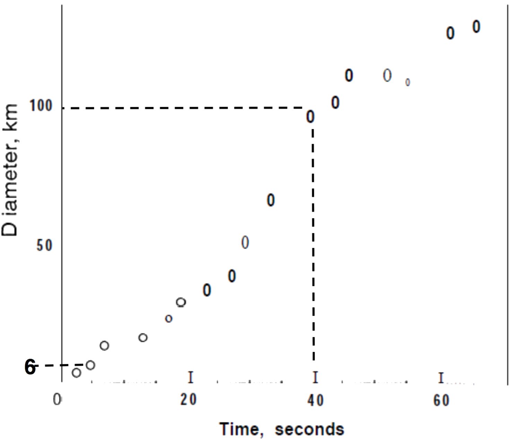

# mt2012b

##2.
In July of 1994, fragments of the comet Shoemaker Levy-9 struck Jupiter. Each impact resulted in fireball of intense energy. The diameter of the fireball versus time after impact is shown for fragment G.

**(a)** If the temperature of the fireball was approximately
$$2000\:\text{K}$$ after $$40\:\text{s}$$, about how hot was it after $$5\:\text{s}$$? Assume the fireball was of uniform temperature at any moment.

**(b)** What was the intensity (power per unit area) received at the top of Earth’s atmosphere from the fragment G fireball? In July, 1994, Jupiter and Earth were approx. $$5\:\text{AU}$$ apart.

**(c)** Assume that all photons emitted by the fragment G fireball had wavelength equal to $$300\:\text{nm}$$, the peak of the spectrum. How many photons per second were emitted by the fireball?